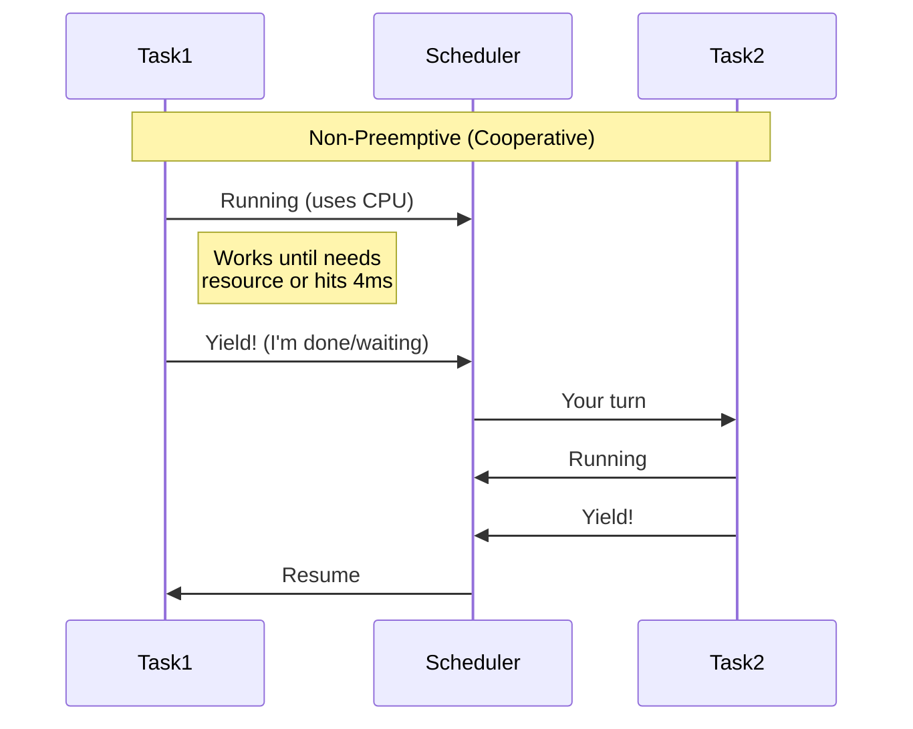
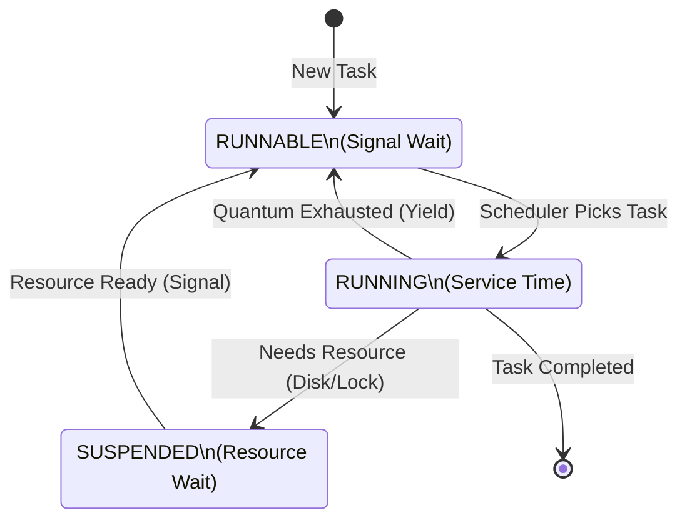

# Module 1: SQL Server Architecture, Scheduling, and Waits

## 1. บทนำ (Introduction)
ในบทเรียนแรกนี้ ผู้เรียนจะได้รับความรู้พื้นฐานเกี่ยวกับสถาปัตยกรรมของ SQL Server ซึ่งเป็นรากฐานสำคัญสำหรับการปรับปรุงประสิทธิภาพ (Performance Tuning) เนื้อหาจะมุ่งเน้นความเข้าใจในกลไกการทำงานของ **SQLOS** และการบริหารจัดการทรัพยากรระหว่าง Database Engine และ Operating System

หลักการทำงาน: SQL Server ทำหน้าที่เป็น Application Server ที่มีการจัดการหน่วยความจำ (Memory) และการประมวลผล (CPU Scheduling) ด้วยตนเอง เพื่อให้เกิดประสิทธิภาพสูงสุดและลด Overhead จากการพึ่งพา OS มากเกินไป

### 1.1 Skill Progression (ทักษะที่ควรได้จาก Module นี้)
- **ระดับ 1 – เข้าใจภาพรวมสถาปัตยกรรม**
  - อธิบายส่วนประกอบหลักของ SQL Server Engine, SQLOS, Scheduler, Tasks/Workers ได้
- **ระดับ 2 – อ่านและแปลความ Wait Statistics ได้**
  - แยกประเภท Resource Wait vs Signal Wait, ระบุ Wait Type หลักที่พบบ่อย และเชื่อมโยงกับอาการในระบบได้
- **ระดับ 3 – ใช้ DMVs เพื่อวิเคราะห์ปัญหาได้จริง**
  - ใช้ `sys.dm_os_schedulers`, `sys.dm_os_wait_stats`, `sys.dm_exec_requests` เพื่อหาคอขวดด้าน CPU / Waits ได้อย่างเป็นขั้นตอน
- **ระดับ 4 – ออกแบบแนวทาง Tuning ตาม Best Practice ของ Microsoft**
  - เชื่อมโยงแนวคิดจาก Module นี้เข้ากับแนวทางจาก Performance Center ของ Microsoft SQL Server และ Azure SQL Database เช่น การโฟกัสที่ CPU, Waits, และ Scheduling เป็นลำดับแรกในการ Tuning (อ้างอิงแนวคิดจาก [Performance Center for SQL Server Database Engine and Azure SQL Database](https://learn.microsoft.com/en-us/sql/relational-databases/performance/performance-center-for-sql-server-database-engine-and-azure-sql-database?view=sql-server-ver17))

---

## 2. SQL Server Components (Lesson 1)

**SQL Server** คือ RDBMS ที่ประกอบด้วยหลาย Components ทำงานร่วมกัน การเข้าใจสถาปัตยกรรมนี้เป็นพื้นฐานสำคัญในการ Tuning

> **หลักการสำคัญ:** ทุก Query ต้องผ่าน **Query Engine** (Compile/Optimize) และ **Storage Engine** (Access Data) ดังนั้นปัญหา Performance อาจเกิดที่ชั้นใดก็ได้

### 2.1 Connection Protocols
Client เชื่อมต่อเข้าสู่ Engine ผ่านทาง "Endpoints" ซึ่งรองรับโปรโตคอลมาตรฐานดังนี้:
1.  **Shared Memory**: ใช้สำหรับการเชื่อมต่อภายในเครื่อง (Local Connection) ให้ประสิทธิภาพสูงสุดเนื่องจากไม่มี Network Overhead
2.  **Named Pipes**: โปรโตคอลดั้งเดิมสำหรับการใช้งานในวง LAN
3.  **TCP/IP**: มาตรฐานหลักสำหรับการเชื่อมต่อผ่านเครือข่าย
    *   *Modern Update (SQL 2022)*: รองรับ **TDS 8.0** ซึ่งมาพร้อมกับมาตรฐานความปลอดภัย **TLS 1.3** ในระดับ Protocol

### 2.2 Database Engine Layers
โครงสร้างการทำงานของ SQL Server แบ่งออกเป็นลำดับชั้น (Layer) ดังนี้:
1.  **Query Execution Layer (Relational Engine)**: ทำหน้าที่ประมวลผลคำสั่ง
    *   *Parser*: ตรวจสอบความถูกต้องของไวยากรณ์ (Syntax)
    *   *Algebrizer*: แปลงคำสั่ง T-SQL เป็นโครงสร้างต้นไม้ทางคณิตศาสตร์ (Query Tree)
    *   *Optimizer*: วิเคราะห์และเลือกแผนการทำงาน (Execution Plan) ที่มีต้นทุนต่ำที่สุด (Cost-based Optimization)
2.  **Storage Engine Layer**: ทำหน้าที่จัดการข้อมูลและเข้าถึงทรัพยากร
    *   *Access Methods*: กลไกการเข้าถึงข้อมูล (Table Scan, Index Seek)
    *   *Buffer Pool Manager*: บริหารจัดการหน่วยความจำสำหรับ Page
    *   *Transaction Manager*: ควบคุม Atomicity และ Locking
3.  **SQLOS Layer**: ทำหน้าที่เป็นเสมือน OS ภายใน (Application-layer OS) จัดการ Thread และ Memory

---

### 2.3 SQLOS & Scheduling Models

SQLOS (SQL Server Operating System) คือเลเยอร์ User-mode ที่ทำหน้าที่ Abstract ทรัพยากร Hardware ออกจาก Windows OS

#### Preemptive vs Non-Preemptive Scheduling

| Aspect | Windows (Preemptive) | SQL Server (Non-Preemptive/Cooperative) |
|:-------|:---------------------|:----------------------------------------|
| **การหยุด Thread** | OS สั่งหยุด (Force) เมื่อหมด Time Slice | Thread หยุดเอง (Yield) เมื่อทำงานเสร็จหรือต้องรอ |
| **Quantum** | ~15.6 ms (Windows default) | ~4 ms |
| **Context Switch** | OS-managed (มี overhead สูงกว่า) | Application-managed (lightweight) |
| **Control** | OS ควบคุม | SQL Server ควบคุมเอง |

> [!NOTE]
> **ทำไม SQL Server ใช้ Non-Preemptive?**
> - ลด Context Switch Overhead (ไม่ต้องรอ OS สั่ง)
> - SQL Server รู้ดีกว่า OS ว่าเมื่อไหร่ควรหยุด (เช่น รอ I/O, รอ Lock)
> - เพิ่มประสิทธิภาพสำหรับ Database Workload

#### PREEMPTIVE_* Wait Types
เมื่อ SQL Server ต้องเรียก Windows API (ออกนอก SQLOS ชั่วคราว):
*   `PREEMPTIVE_OS_GETPROCADDRESS`: ค้นหา DLL function
*   `PREEMPTIVE_OS_AUTHENTICATIONOPS`: Authentication operations
*   `PREEMPTIVE_OS_FILEOPS`: File operations
*   `PREEMPTIVE_OS_LIBRARYOPS`: Load/Unload DLLs

> [!TIP]
> PREEMPTIVE_* waits ที่สูงบ่งชี้ว่า SQL Server ใช้เวลากับ OS calls มาก อาจเกิดจาก Linked Server, xp_cmdshell, หรือ CLR

#### NUMA Architecture
*   SQLOS รองรับสถาปัตยกรรม **Non-Uniform Memory Access (NUMA)**
*   ระบบจะพยายามจัดสรรงาน (Task) ให้ทำงานใน Node เดียวกับ Memory เพื่อลด Latency จากการข้าม Node (Remote Memory Access)

---

### 2.4 Waits & Queues (Wait Statistics)
เมื่อ Thread เปลี่ยนสถานะจาก Running เป็น Suspended ระบบจะบันทึกเหตุการณ์การรอ (Wait Type)
*   **Resource Waits**: การรอทรัพยากร (เช่น Lock, Disk I/O, Network)
*   **Signal Waits**: ทรัพยากรพร้อมแล้ว แต่ต้องรอ CPU ว่าง (อยู่ใน Runnable Queue)
    *   *High Signal Wait Time*: บ่งชี้ปัญหา CPU Pressure (System overload)

#### Common Wait Types

**CPU-Related Waits:**
*   **SOS_SCHEDULER_YIELD**: Thread ส่งคืน CPU (Yield) ตามรอบการทำงานปกติ แต่อาจบ่งชี้ CPU Pressure หากเกิดขึ้นถี่เกินไป
*   **THREADPOOL**: Worker Threads ไม่เพียงพอต่อการรองรับ Request (Starvation) เป็นสถานะวิกฤตที่ต้องเร่งแก้ไข
*   **CXPACKET / CXCONSUMER**: Parallelism waits - Thread รอ Thread อื่นในแผน Parallel ให้เสร็จ

**I/O-Related Waits:**
*   **PAGEIOLATCH_SH/EX**: รอ Data Page จาก Disk (Physical Read) - ค่าสูงบ่งชี้ Disk bottleneck หรือ Memory pressure
*   **WRITELOG**: รอเขียน Transaction Log (Log Buffer → LDF) - ค่าสูงบ่งชี้ Log disk ช้า
*   **ASYNC_IO_COMPLETION**: รอ Async I/O ทั่วไป (Backup, Checkpoint)
*   **IO_COMPLETION**: รอ I/O ที่ไม่ใช่ Data pages (เช่น Sort, Hash operations)

**Memory-Related Waits:**
*   **RESOURCE_SEMAPHORE**: รอ Memory Grant สำหรับ Sort/Hash - Query ต้องการหน่วยความจำมากเกินไป
*   **CMEMTHREAD**: Memory object contention - มักเกิดกับ Plan Cache

**Lock/Blocking-Related Waits:**

Lock คือกลไกที่ป้องกันไม่ให้หลาย Transaction แก้ไขข้อมูลเดียวกันพร้อมกัน ส่วน Latch คือกลไกภายในที่ปกป้องหน้าข้อมูลใน Memory (ดูรายละเอียดใน Module 05)

*   **LCK_M_\***: รอ Lock บนข้อมูล (S=Shared อ่าน, X=Exclusive เขียน, U=Update กำลังจะเขียน)
*   **PAGELATCH_\***: รอ Latch บน Buffer Pool pages - เมื่อหลาย Thread พยายามเข้าถึงหน้าเดียวกันใน Memory (มักเกิดกับ TempDB Allocation Pages)

**Network-Related Waits:**
*   **ASYNC_NETWORK_IO**: SQL Server พร้อมส่งข้อมูลแล้ว แต่ Client รับไม่ทัน

**Background/System Waits:**
*   **LOGBUFFER**: รอ Log Buffer ว่าง - Transaction rate สูงเกินความจุ
*   **BACKUPTHREAD**: ขบวนการ Backup กำลังทำงาน
*   **PREEMPTIVE_OS_***: SQL Server รอ Windows API calls (ออกนอก SQLOS ชั่วคราว)

### 2.5 Request Execution Flow & DMVs

การเข้าใจกระบวนการทำงานของ SQL Server ตั้งแต่ Connection จนถึง Execution จะช่วยให้เลือกใช้ DMV ได้ถูกต้อง:

#### Execution Flow Stages:

| # | Stage | Description | DMV |
|:--:|:------|:------------|:-----|
| 1️⃣ | **Connection** | Client เชื่อมต่อเข้ามา | `sys.dm_exec_connections` |
| 2️⃣ | **Session** | ได้รับ Session ID | `sys.dm_exec_sessions` |
| 3️⃣ | **Request** | ส่งคำสั่ง (Query/Batch) | `sys.dm_exec_requests` |
| 4️⃣ | **Task(s)** | แบ่งงานย่อย (Parallel?) | `sys.dm_os_tasks` |
| 5️⃣ | **Worker** | Task ถูกมอบหมายให้ Worker | `sys.dm_os_workers` |
| 6️⃣ | **Thread** | Worker ใช้ OS Thread ในการรัน | `sys.dm_os_threads` |
| 7️⃣ | **Scheduler** | ควบคุมการทำงานของ Tasks | `sys.dm_os_schedulers` |

#### Special DMVs for Troubleshooting:

| DMV | Purpose | Best Used For |
|:-----|:--------|:--------------|
| `sys.dm_os_waiting_tasks` | แสดง Tasks ที่กำลัง **รอ** ทรัพยากร (SUSPENDED state) | 🔍 Real-time Blocking Analysis |
| `sys.dm_os_wait_stats` | สถิติรวมของ Wait Types ทั้ง Server | 📊 Cumulative Wait Analysis |
| `sys.dm_exec_query_stats` | สถิติของ Query Plans ใน Cache | 📈 Historical Query Performance |

> [!TIP]
> **เลือก DMV ที่เหมาะสม:**
> - ต้องการดู **ใครกำลังรออยู่ตอนนี้** → `sys.dm_os_waiting_tasks`
> - ต้องการดู **ภาพรวมปัญหาสะสม** → `sys.dm_os_wait_stats`

### 2.6 Schedulers, Workers, and Tasks
โครงสร้างการประมวลผลประกอบด้วย 3 ส่วนหลัก:
1.  **Scheduler**: ตัวแทนของ Logical CPU (1 Core = 1 Scheduler)
2.  **Worker**: Thread ของระบบปฏิบัติการที่ SQLOS สร้างขึ้นเพื่อรองรับงาน
    *   *Max Worker Threads*: โดยปกติ SQL Server จะคำนวณค่าที่เหมาะสมให้อัตโนมัติ (Dynamic Scaling)
3.  **Task**: หน่วยงานที่ส่งเข้ามาประมวลผล (Batch Request)

### 2.7 Scheduling Mechanics (Deep Dive)

1.  **Cooperative Scheduling & LDF**:
    *   SQL Server ใช้ระบบที่ Thread ต้องหยุดเอง (Yield)
    *   **Large Deficit First (LDF)**: อัลกอริทึม (SQL 2016+) ที่ช่วยจัดลำดับความสำคัญ ป้องกันไม่ให้ Thread ใหญ่ (เช่น Read-Ahead) แย่ง CPU จน Thread เล็กๆ (Worker) ไม่ได้รัน

2.  **Hidden Schedulers**:
    *   นอกจาก Scheduler ปกติที่ผูกกับ CPU แล้ว ยังมี **Hidden Schedulers** สำหรับงานระบบ
    *   *System Tasks*: Ghost Cleanup, Query Store Async, Checkpoint
    *   *DAC Scheduler*: Dedicated Admin Connection (กู้ชีพเมื่อ Server ค้าง)

> [!WARNING]
> **Fiber Mode (Lightweight Pooling)**: เป็นเทคนิคยุค 90s ที่ให้ 1 Thread แบกหลาย Fiber (User Mode Scheduling) เพื่อลด Context Switch
> *   *Concept*: พยายาม "โกง" OS โดยจัดการ Task เองทั้งหมด ไม่ให้ OS เห็น
> *   *Status*: **Deprecated** (ห้ามใช้ใน SQL 2025+) เพราะทำให้ฟีเจอร์สำคัญพัง (เช่น CLR, XML, Linked Server) และ CPU ปัจจุบันแรงพอแล้ว

### 2.8 The Lifecycle of a Scheduler (State Machine)
วงจรการทำงานของ Thread ประกอบด้วยสถานะดังนี้:

1.  **RUNNING**: Thread กำลังประมวลผลโดยใช้ CPU
    *   *Quantum*: ระยะเวลาสูงสุดที่ Thread ครอง CPU ได้ (ประมาณ 4ms) ก่อนต้องคืนสิทธิ์ (Yield)
2.  **SUSPENDED**: Thread หยุดงานชั่วคราว เพราะต้อง "รอ" บางอย่าง
    *   รอ I/O (Disk) -> `PAGEIOLATCH_SH`
    *   รอ Lock (Resource) -> `LCK_M_X`
3.  **RUNNABLE**: Thread พร้อมทำงานแล้ว (ของที่รอได้มาแล้ว) แต่ต้องไปต่อคิว (Signal Queue) เพื่อรอ Scheduler ว่าง
    *   *Signal Wait Time*: เวลาที่เสียไปในการรอคิวตรงนี้ ถ้าสูงแปลว่า **CPU Pressure**

---

### 2.8 Thread Life Cycle Diagram (Visualized)

---

## 3. Wait Statistics Analysis

การวิเคราะห์ Wait Stats เป็นขั้นตอนสำคัญในการระบุคอขวด (Bottleneck) ของระบบ

### 3.1 Resource Waits vs Signal Waits
ความสัมพันธ์ของเวลาตอบสนอง (Response Time):
$$ \text{Response Time} = \text{Service Time (CPU)} + \text{Wait Time} $$

*   **Service Time**: เวลาที่ใช้ในการประมวลผลจริง
*   **Wait Time**: เวลาที่เสียไปในการรอ
    *   **Resource Waits**: รอทรัพยากร (Disk, Network, Lock) -> แก้ไขโดยการปรับปรุงทรัพยากรหรือลด Contention
    *   **Signal Waits**: รอ CPU -> แก้ไขโดยการลด CPU Consumption ของ Query หรือเพิ่ม CPU Core

### 3.2 Top Wait Types Analysis
1.  **CXPACKET / CXCONSUMER**: เกี่ยวของกับ Parallelism
    *   *Analysis*: ตรวจสอบ `MAXDOP` และ `Cost Threshold for Parallelism` ให้เหมาะสมกับ Workload
2.  **PAGEIOLATCH_XX**: การรออ่านข้อมูลจาก Disk
    *   *Analysis*: ตรวจสอบ Memory Pressure (Buffer Pool) หรือปรับปรุง Query เพื่อลด Logical Reads
3.  **LCK_M_XX**: การรอ Lock
    *   *Analysis*: ตรวจสอบ Blocking Chain และพิจารณาปรับ Isolation Level หรือ Index
4.  **WRITELOG**: การรอเขียน Transaction Log
    *   *Analysis*: ตรวจสอบ Disk Latency ของ Log File
5.  **ASYNC_NETWORK_IO**: ฝั่ง Application รับข้อมูลช้ากว่าที่ SQL ส่งให้
    *   *Analysis*: ตรวจสอบ Application Logic (เช่น Row-by-row processing)

---

## 4. Modern SQL Server Features (2019, 2022+)

### 4.1 Lightweight Query Profiling
*   ในอดีตการเปิด Trace เพื่อดู Execution Plan มี Overhead สูง
*   ปัจจุบัน SQL Server เปิดใช้งาน **Lightweight Profiling** เป็นค่าเริ่มต้น (Default) ช่วยให้สามารถตรวจสอบ `sys.dm_exec_query_profiles` ได้แบบ Real-time โดยมีผลกระทบน้อยมาก

### 4.2 Modern Hardware Support
*   **Persistent Memory (PMEM)**: รองรับการวาง Data/Log file บน PMEM เพื่อลด Latency เหลือระดับ Microsecond
*   **Intel QuickAssist Technology (QAT)**: SQL Server 2022 รองรับการ Offload การบีบอัดข้อมูล (Compression) ไปยัง Hardware พิเศษเพื่อลดภาระ CPU

---

## 5. Lab & Exercises
สำหรับการทดลอง ให้ใช้สคริปต์ในโฟลเดอร์ `Scripts/`:
1.  **วิเคราะห์ CPU Pressure**: รัน `01_Check_Schedulers.sql` ในขณะที่มี Workload หนัก ๆ ดูค่า `runnable_tasks_count`
2.  **วิเคราะห์ภาพรวมระบบ**: รัน `02_Wait_Stats_Analysis.sql` เพื่อดู Top 3 ปัญหาหลักของ Server นี้
3.  **Real-time Troubleshooting**: รัน `03_Current_Executing_Requests.sql` เพื่อดูว่าขณะนี้มีใครรันอะไร แล้วติด Wait อะไรอยู่

> **Tip**: พยายามมองหา Pattern เช่น "ช้าทุกวันช่วง 9 โมง" (Baseline ช่วยได้) หรือ "ช้าเฉพาะ Procedure ตัวนี้" (Query Plan ช่วยได้)

---

## 6. Review Quiz (Knowledge Check)

<b>1. ถ้าพบว่า Wait Type สูงสุดคือ CXPACKET และ CXCONSUMER คู่กัน แปลว่าอะไร?</b>

ส่วนใหญ่เป็นเรื่องปกติของ Parallel Execution แต่ถ้า CXPACKET สูงโดดๆ อาจต้องจูน Cost Threshold for Parallelism หรือ MAXDOP

<b>2. ความแตกต่างระหว่าง Signal Wait และ Resource Wait คืออะไร?</b>

Resource Wait คือรอของ (เช่น Disk/Lock) แต่ Signal Wait คือของมาแล้ว "รอ CPU ว่าง" (บ่งบอก CPU Pressure)

<b>3. สถานะ SUSPENDED หมายถึง Thread กำลังทำอะไร?</b>

Thread หยุดทำงานเพราะต้องรอทรัพยากรบางอย่าง (เช่น รออ่านข้อมูลจาก Disk หรือรอปลด Lock)

