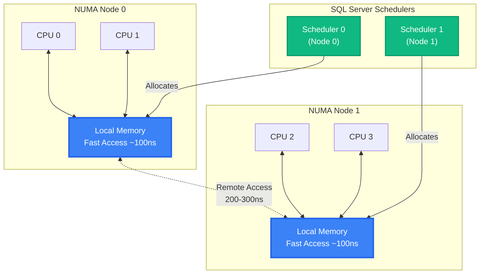
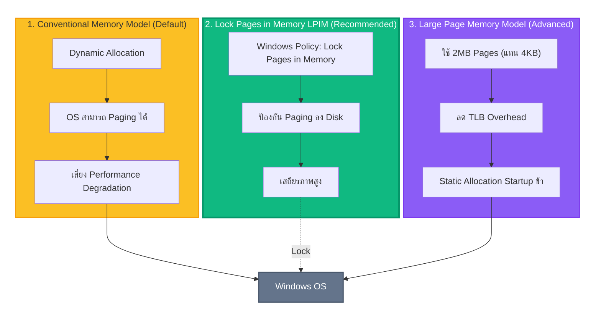
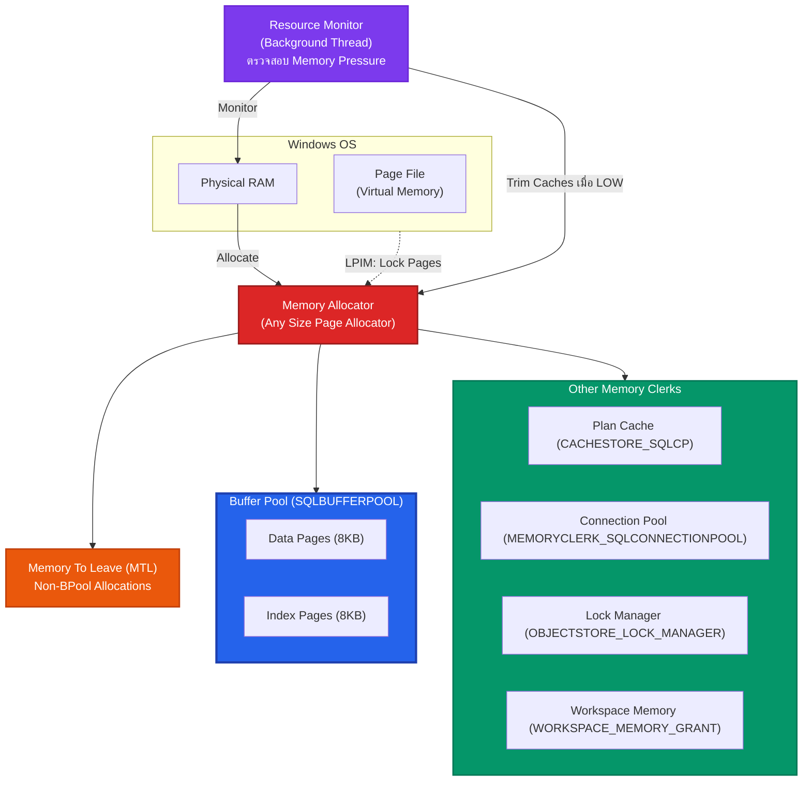
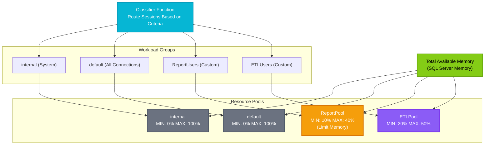
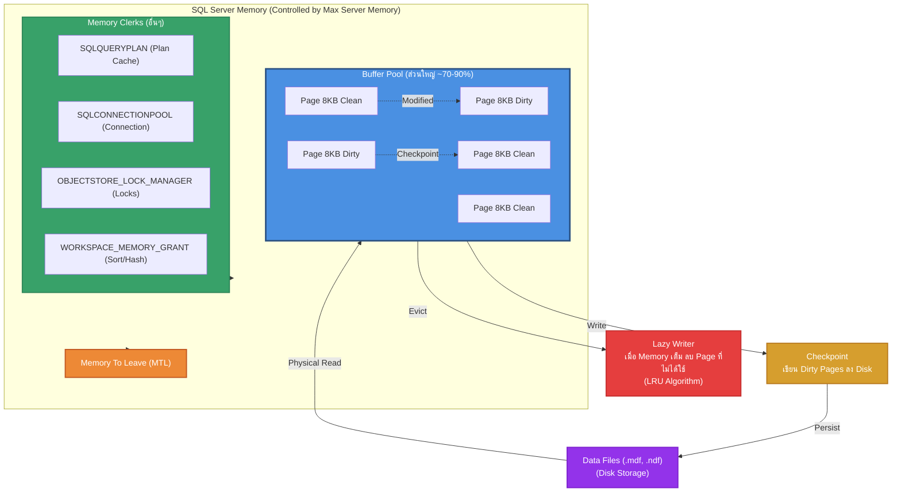
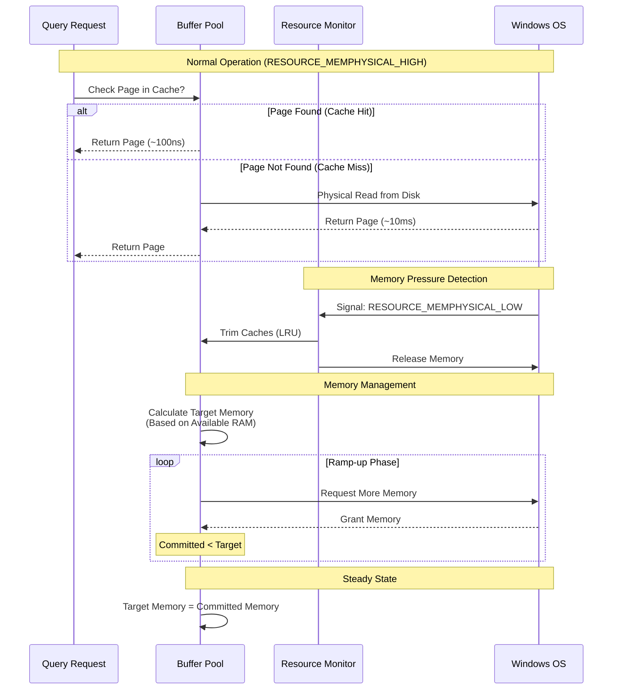
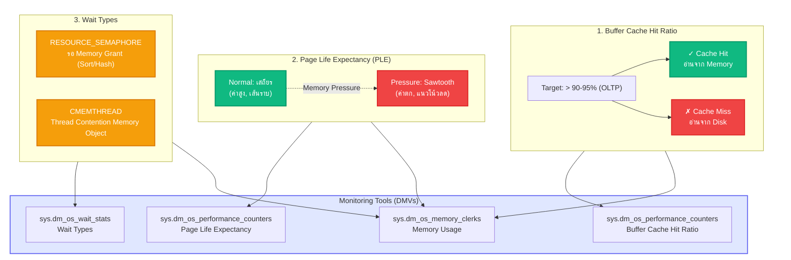

# Module 4: SQL Server Memory

## 1. บทนำ (Introduction)
หน่วยความจำ (Memory) เป็นทรัพยากรที่สำคัญที่สุดสำหรับ SQL Server เนื่องจากการเข้าถึงข้อมูลใน RAM มีความเร็วกว่า Disk หลายพันเท่า การบริหารจัดการ Memory ที่มีประสิทธิภาพจึงเป็นหัวใจสำคัญของการปรับปรุงประสิทธิภาพระบบ (Performance Tuning)

ในบทเรียนนี้ ผู้เรียนจะศึกษาโครงสร้าง Memory Architecture ของ SQL Server, การตั้งค่าที่เหมาะสม, และการวิเคราะห์ปัญหา Memory Pressure

### 1.1 Skill Progression (ทักษะที่ควรได้จาก Module นี้)
- **ระดับ 1 – เข้าใจ Virtual/Physical Memory และ NUMA**
  - อธิบาย Virtual Address Space, Paging, NUMA Node, Local/Remote Memory ได้
- **ระดับ 2 – อ่านโครงสร้าง Memory ภายใน SQL Server**
  - เข้าใจ Buffer Pool, Memory Clerks ต่างๆ, Resource Monitor และ Target/Committed Memory
- **ระดับ 3 – ตั้งค่า Memory ได้อย่างปลอดภัย**
  - คำนวณและกำหนด `max server memory`, ตัดสินใจใช้ LPIM และ Resource Governor ตามแนวทางจาก Performance Center และ Architecture Guide ได้
- **ระดับ 4 – วินิจฉัย Memory Pressure ได้จาก DMVs/Waits**
  - ใช้ `sys.dm_os_process_memory`, `sys.dm_os_memory_clerks`, PLE, และ Wait Types เช่น `RESOURCE_SEMAPHORE` เพื่อหาสาเหตุและออกแบบแนวทางแก้ไขได้อย่างเป็นขั้นตอน

---

---

## 2. Windows Memory (Lesson 1)

### 2.1 Virtual Address Space (VAS)
พื้นที่ Address ที่ Process สามารถมองเห็นและใช้งานได้ ซึ่งแยกอิสระจาก Physical RAM
*   **32-bit Systems**: มีข้อจำกัดสูง (max 4GB) ปัจจุบันไม่แนะนำให้ใช้งาน
*   **64-bit Systems**: รองรับ VAS ขนาดมหาศาล (8TB - 128TB) ทำให้ข้อจำกัดเรื่อง Address Space หมดไป

### 2.2 Physical vs Virtual Memory
*   **Physical Memory**: หน่วยความจำหลัก (RAM)
*   **Virtual Memory**: กลไกของ OS ที่ใช้ Disk (Page File) มาขยายพื้นที่หน่วยความจำ
    *   *Paging*: กระบวนการย้ายหน้าข้อมูล (Pages) ระหว่าง RAM และ Disk
    *   *Impact*: หาก Windows ทำการ Paging Process ของ SQL Server จะส่งผลกระทบต่อประสิทธิภาพอย่างรุนแรง (Performance Degradation)

### 2.3 NUMA (Non-Uniform Memory Access)



สถาปัตยกรรมที่ออกแบบมาเพื่อลดคอขวดของ Memory Bus ในระบบที่มี CPU จำนวนมาก
*   **Local Memory**: หน่วยความจำที่เชื่อมต่อกับ CPU Node นั้นๆ โดยตรง (Access เร็วที่สุด)
*   **Remote Memory**: หน่วยความจำที่อยู่ต่าง Node (Access ช้ากว่า)
*   *SQL Server Awareness*: Engine จะพยายามจัดสรร Memory ใน Node เดียวกับที่ Thread ทำงานเสมอ

---

## 3. SQL Server Memory (Lesson 2)

### 3.1 Memory Models



**รายละเอียด:**
1.  **Conventional Memory Model**: รูปแบบมาตรฐาน (Dynamic Allocation) OS สามารถทำ Paging ได้
2.  **Locked Memory Model (LPIM)**: การกำหนดสิทธิ์ **Lock Pages in Memory**
    *   ป้องกันไม่ให้ Windows นำ SQL Server Memory ไปทำ Paging ลง Disk
    *   *Recommendation*: ควรเปิดใช้งานเสมอสำหรับ Production Server เพื่อเสถียรภาพ
3.  **Large Page Memory Model**: การใช้ Memory Page ขนาดใหญ่ (2MB) แทนขนาดปกติ (4KB)
    *   *Benefit*: ลด Overhead ของ Translation Look-aside Buffer (TLB)
    *   *Drawback*: ต้องจองพื้นที่ทั้งหมดตั้งแต่ Startup (Static Allocation) อาจทำให้เปิด Service ช้า

### 3.2 SQL Server Memory Architecture



**โครงสร้างหลัก:**
*   **Memory Allocator**: ตัวจัดการการของหน่วยความจำจาก OS
*   **Memory Clerks**: ส่วนประกอบที่ทำหน้าที่ดูแลหน่วยความจำแต่ละประเภท
    *   *SQLBUFFERPOOL*: จัดการ Data Pages (Cache หลัก)
    *   *SQLQUERYPLAN*: จัดการ Plan Cache
    *   *SQLCONNECTIONPOOL*: จัดการ Connection Context
*   **Memory To Leave (MTL)**: พื้นที่หน่วยความจำที่ SQL Server เว้นไว้สำหรับ Process ภายนอก Loop (Non-BPool)

### 3.3 Configuration Best Practices
*   **Min Server Memory**: ค่าต่ำสุดที่ SQL Server จะรักษาไว้ (Reserve) -> จะไม่คืน memory ให้ OS ถ้าต่ำกว่าค่านี้
*   **Max Server Memory**: ค่าสูงสุดที่ SQL Server สามารถใช้งานได้ (Buffer Pool & Caches) -> **Critical Setting**
    *   *Calculation*: Total RAM - (OS Reserved + Other Applications)
    *   *Note*: ไม่ครอบคลุม Thread Stacks และ CLR allocations บางส่วน

---

### 3.4 Resource Governor



เครื่องมือสำหรับจำกัดและจัดสรรทรัพยากร (CPU, Memory, I/O) ให้กับ Workload แต่ละประเภท
*   **Workload Group**: กลุ่มของผู้ใช้งาน (เช่น Report Users, Data Load Users)
*   **Resource Pool**: การกำหนดโควต้าทรัพยากร (MIN/MAX Usage)
    *   *Use Case*: ป้องกันไม่ให้ Report ขนาดใหญ่แย่ง Memory จนกระทบต่อระบบ Transaction หลัก

### 3.5 Buffer Pool (The Cache)

**Buffer Pool** คือพื้นที่ใน Memory ที่ SQL Server ใช้เก็บ **Data Pages** (หน่วยข้อมูลขนาด 8KB) ที่อ่านมาจาก Disk เพื่อลดการเข้าถึง Disk ซ้ำๆ

> **ทำไมสำคัญ?** การอ่านจาก Memory (~100 ns) เร็วกว่า Disk (~10 ms) ประมาณ **100,000 เท่า** ดังนั้น "ยิ่งข้อมูลอยู่ใน Buffer Pool มากเท่าไร ยิ่งเร็ว"

**สถาปัตยกรรม Buffer Pool:**



**กระบวนการทำงาน:**
*   **Page Request**: เมื่อ Query ต้องการข้อมูล → ตรวจสอบ Buffer Pool ก่อน → ถ้าไม่มี → อ่านจาก Disk (Physical Read)
*   **Lazy Writer**: เมื่อ Memory เริ่มเต็ม จะลบ Page ที่ไม่ได้ใช้นานออก (LRU Algorithm)
*   **Checkpoint**: บันทึก Dirty Pages (หน้าที่ถูกแก้ไขแล้ว) ลง Disk เป็นระยะ

### 3.6 Other Memory Clerks
นอกจาก Buffer Pool แล้ว ยังมีการใช้ Memory ในส่วนอื่นๆ:
*   **CACHESTORE_SQLCP**: Plan Cache (เก็บ Execution Plans)
*   **OBJECTSTORE_LOCK_MANAGER**: เก็บโครงสร้าง Lock (Lock Structures)
*   **MEMORYCLERK_SQLCONNECTIONPOOL**: เก็บ Connection objects
*   **WORKSPACE_MEMORY_GRANT**: พื้นที่สำหรับ Query Operation (Sort/Hash)

### 3.7 Deep Dive: Memory Management Internals (from Architecture Guide)
ข้อมูลเชิงลึกสำหรับการจัดการหน่วยความจำของ SQL Server ยุคใหม่ (SQL 2012+):

1.  **"Any Size" Page Allocator**:
    *   *Legacy (Pre-2012)*: แยกจัดการระหว่าง Single-Page (<=8KB) และ Multi-Page (>8KB) โดย Max Server Memory คุมแค่ Single-Page
    *   *Modern*: รวมทุก Allocator เข้าด้วยกัน ดังนั้น **Max Server Memory** จึงควบคุมการใช้ Memory เกือบทั้งหมดของ SQL Server (รวม CLR, Multi-Page)
    
2.  **Memory Pressure Detection (Resource Monitor)**:
    *   SQL Server มี Background Thread ชื่อ **Resource Monitor** คอยตรวจสอบสัญญาณหน่วยความจำจาก Windows:
        *   `RESOURCE_MEMPHYSICAL_HIGH`: สภาวะปกติ -> ขยาย Memory ได้เต็มที่
        *   `RESOURCE_MEMPHYSICAL_LOW`: ระบบขาดแคลน Memory -> SQL Server จะเริ่ม **Trim Caches** และคืน Memory ให้ OS
        *   `RESOURCE_MEMPHYSICAL_STEADY`: ทรงตัว
        
        > [!TIP]
        > ดูประวัติการทำงานของ Resource Monitor ได้ด้วย Script:
        > `Scripts\03_Resource_Monitor_Ring_Buffer.sql`

3.  **Dynamic Memory Management**:



**หลักการทำงาน:**
    *   SQL Server ปรับขนาด Memory อัตโนมัติ โดยดูจาก **Target Memory** (เป้าหมายที่อยากได้) vs **Committed Memory** (ที่ขอ OS มาได้จริง)
    *   *Ramp-up*: ช่วงเริ่มต้น Service ที่จะทยอยขอ Memory จนถึง Target

---

## 4. Investigating Memory Pressure

### 4.1 Key Indicators



**รายละเอียด:**
1.  **Buffer Cache Hit Ratio**: อัตราการอ่านข้อมูลได้จาก Cache (ควร > 90-95% สำหรับ OLTP)
2.  **Page Life Expectancy (PLE)**: ค่าเฉลี่ยเวลาที่ Page อยู่ใน Memory (Unit: วินาที)
    *   *Trend*: หากค่าลดลงอย่างรวดเร็ว (Sawtooth pattern) บ่งชี้ถึงแรงกดดันด้าน Memory (Memory Pressure)
3.  **Wait Types**:
    *   `RESOURCE_SEMAPHORE`: Query ต้องรอ Memory Grant (Sort/Hash Workload มีมากเกินไป)
    *   `CMEMTHREAD`: การแย่งชิงเข้าถึง Memory Object (Thread Safety contention)

### 4.2 Modern Memory Feedback (SQL 2019/2022)
*   **Memory Grant Feedback**: SQL Server สามารถจดจำปริมาณ Memory ที่ Query เคยใช้จริง และปรับขนาด Grant ในครั้งถัดไปให้เหมาะสม (ลด Spill / ลด Wasted Memory)
*   **Persistence (SQL 2022)**: ข้อมูล Feedback ถูกบันทึกลง Query Store ทำให้จำค่าได้แม้ Restart Server

---

## 5. In-Memory OLTP (Hekaton) (Lesson 3)
เทคโนโลยีการจัดเก็บและประมวลผลข้อมูลในหน่วยความจำหลัก (Main Memory) เพื่อประสิทธิภาพสูงสุด

### 5.1 Architecture Highlights
*   **Lock-free / Latch-free Data Structures**: ใช้เทคโนโลยี *Optimistic Concurrency Control (MVCC)* ขจัดปัญหา Blocking/Locking
*   **Native Compilation**: แปลง Stored Procedure เป็น **DLL (Machine Code)** เพื่อลด CPU Instructions ในการประมวลผล

### 5.2 Natively Compiled Stored Procedures
คือ Stored Procedure ที่ถูก Compile เป็น Machine Code (C) ทันทีที่สร้าง (Create Time) แทนที่จะ Interpreted ตอนรัน

**ข้อกำหนด (Requirements):**
1.  **SCHEMABINDING**: ต้องผูกติดกับ Table (ห้ามแก้ Table ถ้าไม่ Drop Proc)
2.  **EXECUTE AS OWNER**: ต้องระบุ Context ผู้รัน
3.  **ATOMIC WITH**: ทั้งบล็อกถือเป็น Transaction เดียว (Atomic)

```sql
CREATE PROCEDURE dbo.usp_InsertData 
    @ID INT, 
    @Name NVARCHAR(50)
WITH NATIVE_COMPILATION, SCHEMABINDING
AS BEGIN ATOMIC WITH
(
    TRANSACTION ISOLATION LEVEL = SNAPSHOT, 
    LANGUAGE = N'us_english'
)
    INSERT INTO dbo.MyMemoryTable (ID, Name) 
    VALUES (@ID, @Name);
END;
```

> [!NOTE]
> ประสิทธิภาพสูงกว่า T-SQL ปกติ **10x - 100x** สำหรับ Logic ที่ซับซ้อนและการคำนวณ (Math/String)

### 5.3 Table Types
1.  **Durable (SCHEMA_AND_DATA)**: ข้อมูลคงอยู่ถาวร (มี Checkpoint File Pairs บน Disk)
2.  **Non-Durable (SCHEMA_ONLY)**: ข้อมูลอยู่ใน Memory เท่านั้น (สูญหายเมื่อ Restart) เหมาะสำหรับ ETL Staging หรือ Session State

### 5.4 Index Types for Memory-Optimized
*   **Hash Index**: เหมาะสำหรับการค้นหาแบบเท่ากับ (Equality Search)
*   **Memory-Optimized Non-Clustered Index (Bw-Tree)**: เหมาะสำหรับการค้นหาแบบช่วง (Range Scan)

---

## 6. Lab: Analyzing Memory Spills

**[ไปยังคำแนะนำแล็บ](Labs/README.md)**

ในแล็บนี้ คุณจะระบุ Memory Spills (Sort Warnings) ใน Execution Plans และสังเกตว่า Memory Grant Feedback ของ SQL Server แก้ไขปัญหาอัตโนมัติอย่างไร

### Exercise 1: Reconfigure SQL Server Memory
1.  **Execute Workload**: รัน Script จำลองการโหลดหนักๆ (PowerShell/SQLCMD)
2.  **Monitor Wait Stats**: สังเกต `sys.dm_os_wait_stats` ว่า `RESOURCE_SEMAPHORE` ขึ้นหรือไม่?
3.  **Fix Configuration**:
    *   ใช้ `sp_configure` ตั้งค่า `min server memory` และ `max server memory`
    *   *Example*: Set Max = 4096 MB (สำหรับเครื่อง Lab)
    *   *Command*:
        ```sql
        EXEC sp_configure 'show advanced options', 1; RECONFIGURE;
        EXEC sp_configure 'max server memory (MB)', 4096; RECONFIGURE;
        ```
4.  **Verify**: รัน Workload เดิมอีกครั้ง แล้วดูว่า Wait หายไปหรือไม่ (ถ้า RAM พอควรจะหายไป)

### Exercise 2: Buffer Usage Analysis
*   ใช้ `01_Buffer_Usage_By_DB.sql` เพื่อดูว่าใครกินแรมไป

---

## 7. Review Quiz (Knowledge Check)

<details>
<summary><b>1. Page Life Expectancy (PLE) หมายถึงอะไร?</b></summary>
ค่าเฉลี่ยเวลาที่ Page อยู่ใน Buffer Pool (หน่วยเป็นวินาที) ถ้าค่าลดลงอย่างรวดเร็ว (รูปฟันเลื่อย) บ่งบอก Memory Pressure
</details>

<details>
<summary><b>2. Lock Pages in Memory (LPIM) มีประโยชน์อย่างไร?</b></summary>
ป้องกันไม่ให้ Windows นำ SQL Server Memory ไปทำ Paging ลง Disk ช่วยให้ระบบมีเสถียรภาพมากขึ้น
</details>

<details>
<summary><b>3. RESOURCE_SEMAPHORE wait type บอกอะไร?</b></summary>
บอกว่า Query ต้องรอ Memory Grant สำหรับ Sort/Hash Operation แสดงว่ามี Workload ที่ต้องการ Memory เยอะเกินไป
</details>
