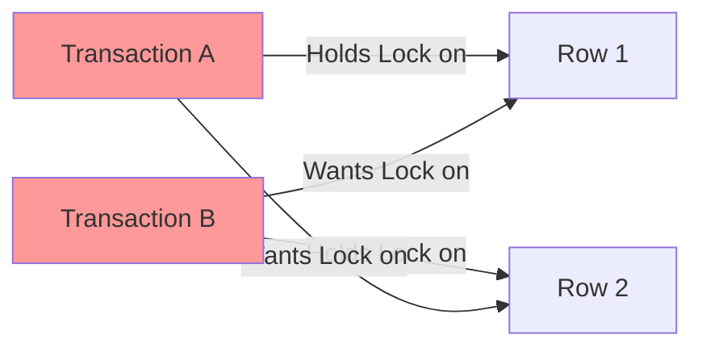
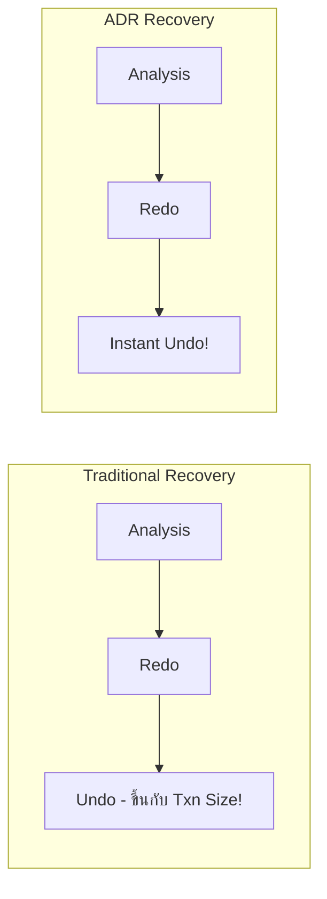

# Module 5: SQL Server Concurrency

## 1. บทนำ (Introduction)
Concurrency คือความสามารถของระบบฐานข้อมูลในการรองรับการเข้าถึงข้อมูลจากผู้ใช้งานหลายคนพร้อมกัน โดยยังคงรักษาความถูกต้อง (Consistency) และประสิทธิภาพ (Performance) ไว้ได้ กลไกหลักที่ SQL Server ใช้ในการจัดการ Concurrency คือ **Locking** และ **Transaction Isolation Levels**

ในบทเรียนนี้ ผู้เรียนจะศึกษาเกี่ยวกับ Concurrency Models, Transaction Properties (ACID), และการจัดการ Isolation Levels เพื่อลดปัญหา Blocking

### 1.1 Skill Progression (ทักษะที่ควรได้จาก Module นี้)
- **ระดับ 1 – เข้าใจ ACID และ Isolation Levels**
  - อธิบาย Pessimistic/Optimistic Concurrency, Isolation Level ต่างๆ และผลข้างเคียง เช่น Dirty/Non-repeatable/Phantom Reads ได้
- **ระดับ 2 – อ่านและวิเคราะห์ Lock/Blocking ได้**
  - ใช้ DMV เช่น `sys.dm_tran_locks`, `sys.dm_exec_requests` และสคริปต์แล็บเพื่อดู Blocking Chain, Lock Modes/Granularity ได้
- **ระดับ 3 – ออกแบบ/เลือก Concurrency Model ให้เหมาะกับระบบ**
  - เลือกใช้ READ COMMITTED, RCSI, SNAPSHOT ให้เหมาะกับ Workload, เข้าใจข้อดีข้อเสีย/ผลกระทบต่อ TempDB และ Version Store
- **ระดับ 4 – แก้ปัญหา Deadlock และ Contention ขั้นสูง**
  - ใช้ XEvents/`system_health`, วิเคราะห์ Deadlock Graph, และออกแบบแนวทางลด Deadlock, Lock Escalation, Latch/Spinlock Contention ได้อย่างเป็นขั้นตอน

---

## 2. Concurrency and Transactions (Lesson 1)

### 2.1 Concurrency Models
1.  **Pessimistic Concurrency**: รูปแบบที่เน้นความถูกต้องสูงสุด โดยสันนิษฐานว่าจะเกิดข้อขัดแย้ง (Conflict) ขึ้นเสมอ จึงทำการ Lock ข้อมูลทันทีที่มีการอ่านหรือแก้ไข
    *   *Result*: รับประกัน Data Consistency สูงสุด แต่มีโอกาสเกิด Blocking สูง (เป็น Default Behavior ของ SQL Server)
2.  **Optimistic Concurrency**: รูปแบบที่เน้นประสิทธิภาพ โดยสันนิษฐานว่าจะไม่เกิดข้อขัดแย้ง จึงไม่มีการ Lock ระหว่างอ่าน แต่จะตรวจสอบความถูกต้อง (Validation) เมื่อทำการ Commit โดยใช้ Row Versioning
    *   *Result*: ลด Blocking ได้อย่างมีนัยสำคัญ แต่ต้องมีกลไกจัดการ Conflict หากข้อมูลถูกแก้ไขโดยผู้อื่นในระหว่างนั้น

### 2.2 Transaction Internals
Transaction คือหน่วยของงานทางตรรกะ (Logical Unit of Work) ซึ่งต้องมีคุณสมบัติ **ACID**:
*   **Atomicity**: ความเป็นหนึ่งเดียว (ทำสำเร็จทั้งหมด หรือยกเลิกทั้งหมด)
*   **Consistency**: ความถูกต้องสมบูรณ์ (ต้องไม่ละเมิด Integrity Constraints)
*   **Isolation**: ความเป็นอิสระ (Transaction หนึ่งต้องไม่ส่งผลกระทบต่ออีก Transaction หนึ่งที่ทำงานขนานกัน)
*   **Durability**: ความคงทน (เมื่อ Commit แล้ว ข้อมูลต้องอยู่ถาวรแม้ระบบจะล่ม)

*Transaction Modes*:
1.  **Auto-commit** (Default): แต่ละคำสั่งถือเป็น 1 Transaction และ Commit ทันทีที่สำเร็จ
2.  **Explicit**: กำหนดขอบเขตชัดเจนด้วย `BEGIN TRAN`, `COMMIT`, `ROLLBACK`
3.  **Implicit**: เริ่ม Transaction อัตโนมัติเมื่อมีคำสั่ง DML แต่ต้องสั่ง Commit/Rollback เอง

### 2.3 Isolation Levels
ระดับความเข้มงวดในการแยก Transaction (เรียงจากน้อยไปมาก):
1.  **READ UNCOMMITTED**: อนุญาตให้อ่านข้อมูลที่ยังไม่ Commit (Dirty Read) -> เสี่ยงต่อความผิดพลาดสูง
2.  **READ COMMITTED** (Default): อ่านได้เฉพาะข้อมูลที่ Commit แล้วเท่านั้น (ป้องกัน Dirty Read)
3.  **REPEATABLE READ**: รับประกันว่าค่าที่อ่านแล้วจะยังคงเดิมจนจบ Transaction (ป้องกัน Non-Repeatable Read)
4.  **SERIALIZABLE**: ระดับสูงสุด ป้องกันการแทรกแถวใหม่ในช่วงที่อ่าน (ป้องกัน Phantom Read) -> มีโอกาส Blocking และ Deadlock สูงสุด
5.  **SNAPSHOT**: ใช้ Row Versioning เพื่อให้อ่านข้อมูลเวอร์ชันก่อนหน้าแทนการรอ Lock

### 2.4 Modern Concurrency (RCSI)
**Read Committed Snapshot Isolation (RCSI)** คือการปรับเปลี่ยนพฤติกรรมของ READ COMMITTED ให้ใช้ Row Versioning แทน Locking
*   *Mechanism*: Reader อ่านข้อมูลจาก Version Store (TempDB) แทนการรอ Lock จาก Writer
*   *Benefit*: ลด Blocking ระหว่าง Reader และ Writer อย่างมหาศาล

---

## 3. Locking Internals (Lesson 2)

### 3.1 Locking Architecture
*   **Lock Manager**: กลไกภายใน (Internal Mechanism) ทำหน้าที่จัดการสถานะของ Lock ทั้งหมดในระบบ
*   **Lock Granularity**: ระดับความละเอียดของการ Lock (Hierarchy)
    *   *RID*: Row Identifier (สำหรับ Heap)
    *   *KEY*: Lock ที่ระดับ Index Key (สำหรับ B-Tree)
    *   *PAGE*: Lock ที่ระดับ Page (8KB)
    *   *EXTENT*: Lock ที่ระดับ Extent (64KB)
    *   *HoBT* (Heap or B-Tree): Lock ทั้ง Partition
    *   *TABLE*: Lock ทั้งตาราง
    *   *DATABASE*: Lock ทั้งฐานข้อมูล

### 3.2 Lock Modes
*   **S (Shared)**: สำหรับการอ่าน (Read) อนุญาตให้ผู้อื่นอ่านร่วมได้ แต่ห้ามแก้ไข
*   **X (Exclusive)**: สำหรับการแก้ไข (Write) ไม่อนุญาตให้ผู้อื่นอ่านหรือแก้ไขซ้อน
*   **U (Update)**: ใช้ป้องกัน Deadlock ในช่วงเริ่มต้นของการ Update (เปลี่ยนจาก S -> U -> X)
*   **IS/IX (Intent)**: "Intent Lock" ใช้เพื่อระบุเจตนาในระดับโครงสร้างแม่ (Hierarchy) ว่าจะมีการ Lock ในระดับลูก
*   **Sch-S/Sch-M (Schema)**: Lock โครงสร้างตาราง (ป้องกันการ DDL ระหว่างที่มี Active Transaction)

#### Lock Compatibility Matrix

#### Lock Compatibility Matrix

| Request \ Granted | **IS** | **S** | **U** | **IX** | **X** |
|:------------------|:------:|:-----:|:-----:|:------:|:-----:|
| **IS** (Intent Shared) | ✅ | ✅ | ✅ | ✅ | ❌ |
| **S** (Shared) | ✅ | ✅ | ✅ | ❌ | ❌ |
| **U** (Update) | ✅ | ✅ | ❌ | ❌ | ❌ |
| **IX** (Intent Exclusive) | ✅ | ❌ | ❌ | ✅ | ❌ |
| **X** (Exclusive) | ❌ | ❌ | ❌ | ❌ | ❌ |

> **Legend:** ✅ = Compatible (สามารถทำงานร่วมกันได้) | ❌ = Incompatible (เกิด Blocking)

> [!NOTE]
> **ตัวอย่างการใช้งาน:**
> - **S + S = ✅** → อ่านพร้อมกันได้หลายคน
> - **S + X = ❌** → ไม่สามารถอ่านขณะที่มีคนกำลังแก้ไข
> - **X + X = ❌** → ไม่สามารถแก้ไขพร้อมกัน (Blocking เกิดขึ้น)

### 3.3 Lock Escalation
*   **Concept**: การเปลี่ยนระดับ Lock จากละเอียด (Row/Page) เป็นหยาบ (Table) เพื่อลด Memory Overhead
*   **Trigger Conditions** (เกิดเมื่อตรงข้อใดข้อหนึ่ง):
    1.  **Lock Count**: มีการใช้ Lock เกิน **5,000 Locks** ในหนึ่งคำสั่ง (ต่อหนึ่ง Table)
    2.  **Memory Threshold**: การใช้ Memory สำหรับ Lock เกิน **24%** ของ Memory ที่ Database Engine ใช้ (หรือ 40% หากมีการตั้งค่า `locks` option)
    *   *Retry*: หาก Escalate ไม่สำเร็จ (เช่นติด Conflict) จะพยายามใหม่ทุกๆ **1,250 Locks** ที่เพิ่มขึ้น
*   **Trade-off**: ประหยัดหน่วยความจำ แต่ลด Concurrency อย่างรุนแรง (Table Lock)
*   **Control**: สามารถปรับแต่งได้ด้วย `ALTER TABLE SET LOCK_ESCALATION = AUTO` (เพื่อให้ Escalate ที่ระดับ Partition แทน Table)

### 3.4 Optimized Locking (SQL Server 2022+)

> [!IMPORTANT]
> **Optimized Locking** เป็นฟีเจอร์ใหม่ใน SQL Server 2022 ที่ปรับปรุงระบบ Locking ครั้งใหญ่

**แนวคิดหลัก: Transaction ID (TID) Locking**
แทนที่จะถือ Row/Page Locks ตลอด Transaction, SQL Server 2022 ใช้:
1. **Lock After Qualification (LAQ)**: รอจนหา Row ที่ต้องการแก้ไขเจอก่อนแล้วค่อย Lock
2. **TID Lock**: ถือแค่ Lock บน Transaction ID แทน Row Lock

| Aspect | Traditional Locking | Optimized Locking |
|:-------|:---------------------|:------------------|
| **Row Locks** | ถือตลอด Transaction | ปล่อยทันทีหลัง Modify |
| **Memory Usage** | ⚠️ สูง (หลาย Locks) | ✅ ต่ำ (แค่ TID Lock) |
| **Lock Escalation** | ⚠️ เกิดบ่อย | ✅ แทบไม่เกิด |
| **Blocking** | ⚠️ มากกว่า | ✅ น้อยกว่า |

```sql
-- ตรวจสอบว่า Optimized Locking เปิดใช้งานหรือไม่
SELECT name, is_optimized_locking_on
FROM sys.databases
WHERE name = DB_NAME();
```

> [!NOTE]
> Optimized Locking ทำงานร่วมกับ **ADR (Accelerated Database Recovery)** โดยอัตโนมัติ

### 3.5 Key-Range Locking

ใช้สำหรับป้องกัน **Phantom Reads** ใน SERIALIZABLE Isolation Level:

*   **Mechanism**: Lock ช่วงของ Key Values ใน Index แทนที่จะ Lock แค่ Row ที่มีอยู่
*   **Use Case**: `WHERE Price BETWEEN 10 AND 20` จะ Lock ทั้งช่วง 10-20 ไม่อนุญาตให้ INSERT ค่าใหม่ในช่วงนี้

#### Key-Range Lock Modes

| Mode | Description |
|------|-------------|
| **RangeS-S** | Shared range, Shared resource (SELECT) |
| **RangeS-U** | Shared range, Update resource |
| **RangeI-N** | Insert range, Null resource (Prevent inserts) |
| **RangeX-X** | Exclusive range, Exclusive resource |

> [!WARNING]
> **SERIALIZABLE + Key-Range Locking** = Blocking มาก! ควรใช้เฉพาะกรณีที่ต้องการ Consistency แบบ 100%

### 3.6 Parallelism Configuration (Microsoft Best Practices)
การตั้งค่า Parallelism ที่ไม่เหมาะสมเป็นสาเหตุหลักของปัญหา `CXPACKET` wait type และ CPU Overhead:

1.  **Max Degree of Parallelism (MAXDOP)**: จำกัดจำนวน CPU Cores ที่ใช้ต่อ 1 Query
    *   *Default*: 0 (ใช้ทุก Cores) -> **ไม่แนะนำ** สำหรับ Server ปัจจุบันที่มี Core เยอะ
    *   *Recommendation*:
        *   NUMA Node > 8 cores: ตั้งค่า = 8
        *   NUMA Node < 8 cores: ตั้งค่า = จำนวน Cores ใน Node
    *   *Goal*: ป้องกันไม่ให้ Query เดียวแย่ง CPU ไปจนหมดเครื่อง

2.  **Cost Threshold for Parallelism**: เกณฑ์ Cost ต่ำสุดที่จะให้ทำ Parallel
    *   *Default*: 5 (ค่าโบราณจากยุค 90s) -> ต่ำเกินไป ทำให้ Query เล็กๆ พยายามทำ Parallel จนเกิด Overhead ในการจัดการ Thread มากกว่าประโยชน์ที่ได้รับ
    *   *Recommendation*: ปรับเพิ่มเป็น **25 - 50**

> [!TIP]
> การตั้งค่าสองตัวนี้ช่วยลดปัญหา **Excessive Parallelism** ได้ทันทีโดยไม่ต้องแก้ Code

### 3.7 Locking Hints
การใช้ Query Hint เพื่อบังคับพฤติกรรมของ Lock Manager (ควรใช้ด้วยความระมัดระวัง):
*   `NOLOCK`: อ่านแบบ Read Uncommitted (Ignore Locks) -> อาจได้ข้อมูลที่ไม่ถูกต้อง (Dirty Read)
*   `XLOCK`: บังคับขอ Exclusive Lock ทันที
*   `TABLOCK`: บังคับใช้ Table Lock เพื่อลด Overhead ของ Row Lock (เหมาะสำหรับ Bulk Load)
*   `READPAST`: ข้ามแถวที่ติด Lock ไปเลย (เหมาะสำหรับระบบ Queue Processing)

### 3.8 Deep Dive: Locking & Versioning Mechanics (from Architecture Guide)

1.  **Dynamic Locking Strategy**:
    *   *Example*: Index Scan อาจเลือกใช้ **Page Lock** เพื่อลด Overhead ในการจัดการ Row locks จำนวนมหาศาล

    > [!NOTE]
    > **ความต่างคือช่วงเวลา (Timing)**:
    > - **Dynamic Locking** เป็นการตัดสินใจแบบ **Proactive** (คิดก่อนทำ) โดย Query Optimizer เลือก Granularity ที่ดีที่สุดตั้งแต่เริ่ม Plan
    > - **Lock Escalation** เป็นการทำงานแบบ **Reactive** (แก้ปัญหาหน้างาน) เกิดขึ้นเมื่อใช้ Memory เกินโควตา จึงต้องเปลี่ยนจาก Row -> Table กลางคัน

2.  **Lock Partitioning (Advanced)**:
    *   สำหรับเครื่องที่มี CPU >= 16 Cores SQL Server จะเปิดใช้ **Lock Partitioning** อัตโนมัติ
    *   *Concept*: แยก Lock Resource ออกเป็นหลายส่วนตาม NUMA Node เพื่อลด Contention ในการขอ Lock (แย่งกันจอง)

3.  **Special Lock Types**:
    *   **Sch-S (Schema Stability)**: เกิดขึ้นตอน Validate Schema ระหว่าง Compile Query (ไม่ Block ใคร ยกเว้น DDL)
    *   **Sch-M (Schema Modification)**: เกิดขึ้นตอนทำ DDL (Alter Table, Rebuild Index) -> **Block ทุกอย่าง** แม้แต่ NOLOCK
    *   **BU (Bulk Update)**: เกิดขึ้นเมื่อใช้ `BULK INSERT` หรือ `bcp` คู่กับ hint `TABLOCK` เพื่อให้หลาย Thread โหลดข้อมูลเข้า Table เดียวกันได้พร้อมกัน

3.  **Snapshot Update Conflicts (Error 3960)**:
    *   ใน Isolation Level **SNAPSHOT** (ไม่ใช่ RCSI) หาก Transaction A อ่านข้อมูล แล้วพยายามแก้ไข แต่ระหว่างนั้น Transaction B ชิงแก้ไขและ Commit ตัดหน้าไปแล้ว
    *   *Result*: Transaction A จะล้มเหลวทันทีด้วย **Error 3960** (Snapshot Isolation Transaction Aborted due to Update Conflict)
    *   *Fix*: Application ต้องมี Logic ในการ **Retry** Transaction นี้ใหม่

### 3.9 Latches & Spinlocks (Internal Synchronization)

นอกจาก Lock ที่ใช้ปกป้องข้อมูลของผู้ใช้แล้ว SQL Server ยังมีกลไกอื่นๆ ที่ใช้ประสานงานภายใน Engine เพื่อป้องกันไม่ให้หลาย Thread เข้าถึงโครงสร้างข้อมูลเดียวกันพร้อมกัน

**🏠 เปรียบเทียบกับบ้าน:**
- **Lock** = กุญแจห้องนอน (ปกป้องข้าวของ = Data) - ล็อกนาน รอได้
- **Latch** = กุญแจตู้เย็น (ปกป้องอาหารชั่วคราว = Buffer Pages) - ล็อกสั้น ไม่รอนาน
- **Spinlock** = กุญแจเครื่องชงกาแฟ (ใช้แป๊บเดียว = Internal Structures) - ยืนรอหมุนตัวตรงนั้น

**ทำไมต้องมีหลายระดับ?**
เพราะการ "รอ" มีต้นทุน (Context Switch) ถ้าของที่ต้องการใช้แค่แป๊บเดียว การวนรอ CPU ดีกว่าการนอนรอแล้วปลุกใหม่

#### Lock Hierarchy: Lock → Latch → Spinlock

| Type | ใช้ปกป้องอะไร | เมื่อต้องรอ | ถือนานแค่ไหน | Wait Type |
|:-----|:--------------|:------------|:-------------|:----------|
| 🔒 **Lock** | ข้อมูลผู้ใช้ (Row, Page, Table) | Thread นอนรอ (Blocking) | นาน (ตลอด Transaction) | `LCK_M_*` |
| 🔐 **Latch** | หน้าข้อมูลใน Memory (Buffer Pool) | Thread นอนรอ (Blocking) | สั้น | `PAGELATCH_*` |
| ⚙️ **Spinlock** | โครงสร้างภายใน Engine | Thread วนลูป (Spinning) | สั้นมาก | ไม่มี (ใช้ CPU วนลูป) |

#### Latch Types
*   `PAGELATCH_SH/EX`: Latch บน Data Page ใน Buffer Pool
*   `PAGEIOLATCH_SH/EX`: รอ I/O ของ Page (Disk → Memory)
*   `LATCH_SH/EX`: Latch อื่นๆ (เช่น บน Hash Tables)

#### Spinlock Contention (Advanced)

Spinlocks มักเป็นปัญหากับ Server ที่มี **24+ CPU Cores**

**อาการ:**
*   **High CPU** โดยไม่มี Wait Type ที่ชัดเจน
*   `SOS_SCHEDULER_YIELD` Wait สูง
*   CPU Utilization สูงแต่ Throughput ไม่เพิ่ม

```sql
-- ตรวจสอบ Spinlock Statistics
SELECT 
    name AS [Spinlock Name],
    spins AS [Spins],
    spins_per_collision AS [Spins/Collision],
    backoffs AS [Backoffs],
    sleep_time AS [Sleep Time]
FROM sys.dm_os_spinlock_stats
ORDER BY spins DESC;
```

#### Common Spinlock Issues

| Spinlock | Cause | Solution |
|:---------|:-----|:---------|
| `LOCK_HASH` | High lock volume | Reduce lock duration, use RCSI |
| `SOS_OBJECT_STORE` | Heavy object allocation | Reduce temp table creation |
| `LOGCACHE_ACCESS` | High transaction rate | Batch transactions |
| `OPT_IDX_STATS` | Statistics contention | Update stats off-peak |

> [!NOTE]
> **SQL Server 2022** ปรับปรุง Spinlock Algorithm ให้มีประสิทธิภาพมากขึ้น

### 3.10 Deadlocks (รายละเอียด)

Deadlock เกิดเมื่อ Transaction สองตัว (หรือมากกว่า) ต่างรอทรัพยากรซึ่งกันและกัน (Cyclic Dependency)



#### Deadlock Detection & Resolution
*   **Lock Monitor Thread**: ตรวจสอบทุก 5 วินาที (ลดลงเหลือทุก 100ms หากตรวจพบ Deadlock ครั้งแรก)
*   **Victim Selection**: เลือก Transaction ที่มี Log Records น้อยกว่า (Cost to Rollback ต่ำกว่า)
*   **Error 1205**: Transaction ที่เป็น Victim จะได้รับ Error นี้ และถูก Rollback

#### วิธีลด Deadlocks

| Strategy | Description |
|:---------|:------------|
| 🔄 **Access Order** | เข้าถึง Objects ในลำดับเดียวกันเสมอ |
| ⚡ **Short Transactions** | ทำ Transaction ให้สั้น, Commit เร็ว |
| 🚫 **Avoid User Interaction** | ห้าม Wait user input ใน Transaction |
| 📸 **Use RCSI** | ใช้ Row Versioning แทน Shared Locks |
| 📊 **Indexes** | Query ที่ใช้ Index ถือ Lock น้อยกว่า Table Scan |

#### Deadlock Tools

| Tool | Description |
|:-----|:------------|
| `system_health` XEvent | 🔍 จับ Deadlock Graph อัตโนมัติ |
| `xml_deadlock_report` XEvent | 📝 สร้าง XEvent session เฉพาะสำหรับ Deadlocks |
| Error Log | 📋 Trace Flag 1222 บันทึก Detailed Deadlock info |

```sql
-- ดู Deadlock จาก system_health XEvent
SELECT XEvent.query('(event/data/value/deadlock)[1]') AS deadlock_graph
FROM (
    SELECT CAST(target_data AS XML) AS TargetData
    FROM sys.dm_xe_session_targets st
    INNER JOIN sys.dm_xe_sessions s ON s.address = st.event_session_address
    WHERE s.name = 'system_health' AND st.target_name = 'ring_buffer'
) AS Data
CROSS APPLY TargetData.nodes('RingBufferTarget/event[@name="xml_deadlock_report"]') AS XEventData(XEvent);
```

---

## 4. Modern Concurrency Features

### 4.1 Row Versioning-Based Isolation Levels

SQL Server รองรับ 2 รูปแบบของ Row Versioning:

#### RCSI vs Snapshot Isolation

| Feature | READ_COMMITTED_SNAPSHOT (RCSI) | SNAPSHOT Isolation |
|:--------|:------------------------------|:-------------------|
| **เปิดใช้งาน** | Database option | Database option + Session level |
| **Scope** | Statement-level consistency | Transaction-level consistency |
| **ข้อมูลที่อ่าน** | Committed ณ ตอนเริ่ม Statement | Committed ณ ตอนเริ่ม Transaction |
| **Update Conflicts** | ไม่มี (ใช้ Lock ปกติ) | ⚠️ มี! (Error 3960 หากแก้ไขข้อมูลที่ถูกเปลี่ยนระหว่าง Transaction) |
| **Use Case** | ✅ OLTP ทั่วไป, Azure SQL Default | 📊 Report ที่ต้องการ Consistent View |

```sql
-- เปิดใช้ RCSI (แนะนำสำหรับ OLTP)
ALTER DATABASE [YourDB] SET READ_COMMITTED_SNAPSHOT ON;

-- เปิดใช้ Snapshot Isolation
ALTER DATABASE [YourDB] SET ALLOW_SNAPSHOT_ISOLATION ON;

-- ใช้งาน Snapshot ใน Session
SET TRANSACTION ISOLATION LEVEL SNAPSHOT;
```

> [!TIP]
> **Azure SQL Database** เปิด RCSI เป็น **Default** ตั้งแต่แรก!

### 4.2 Version Store Location

| Configuration | Version Store Location | Notes |
|:--------------|:----------------------|:------|
| **RCSI/Snapshot (No ADR)** | TempDB | ⚠️ ต้องดูแล TempDB size |
| **ADR Enabled** | User Database (PVS) | ✅ Persistent Version Store |

> [!WARNING]
> **TempDB Full = Version Store Problems!**
> - Read operations อาจ fail (ไม่พบ version)
> - Monitor `tempdb` space และ `version_store_reserved_page_count`

---

## 5. Accelerated Database Recovery (ADR)
(Feature ตั้งแต่ SQL Server 2019 เป็นต้นไป)

### 5.1 Traditional vs ADR Recovery



| Aspect | Traditional | ADR |
|:-------|:------------|:----|
| **Undo Time** | ขึ้นกับขนาด/จำนวน Uncommitted Txns | ✅ **Constant time** (~วินาที) |
| **Log Truncation** | ต้องรอ Oldest Active Txn | ✅ ไม่ต้องรอ (สามารถ Truncate ได้เร็ว) |
| **Version Store** | TempDB | ✅ **PVS in User Database** |

### 5.2 เปิดใช้งาน ADR

```sql
-- เปิด ADR
ALTER DATABASE [YourDB] SET ACCELERATED_DATABASE_RECOVERY = ON;

-- ตรวจสอบสถานะ
SELECT name, is_accelerated_database_recovery_on
FROM sys.databases
WHERE name = 'YourDB';

-- ดู PVS size
SELECT 
    DB_NAME(database_id) AS [Database],
    persistent_version_store_size_kb / 1024 AS [PVS Size (MB)]
FROM sys.dm_tran_persistent_version_store_stats;
```

> [!NOTE]
> **ADR เป็น Prerequisite สำหรับ Optimized Locking (SQL 2022)**

---

## 6. Lab: Analyzing Blocking and Deadlocks

**[ไปยังคำแนะนำแล็บ](LABS/Lab_Instructions.md)**

ในแล็บนี้ คุณจะใช้สอง Session เพื่อจำลองสถานการณ์ Blocking Chain และ Deadlock จากนั้นวิเคราะห์ปัญหาโดยใช้ DMVs

---

## 7. Review Quiz (Knowledge Check)

<details>
<summary><b>1. Isolation Level ใดที่เป็น Default ของ SQL Server และมีโอกาสเกิด Blocking สูง?</b></summary>
Read Committed (แบบ Pessimistic ซึ่งใช้ Shared Lock ในการอ่าน)
</details>

<details>
<summary><b>2. Lock Escalation คืออะไร และทำไม SQL Server ถึงทำ?</b></summary>
คือการเปลี่ยนจาก Lock แถว (Row) เป็น Lock โต๊ะ (Table) เมื่อมีการ Lock มากเกินไป (เกิน 5,000) เพื่อประหยัด Memory แต่อาจทำให้คนอื่นใช้งาน Table นั้นไม่ได้เลย
</details>

<details>
<summary><b>3. วิธีแก้ไข Deadlock ที่ดีที่สุดคืออะไร?</b></summary>
จัดลำดับการเข้าถึงตารางให้เหมือนกันในทุก Transaction (Access Objects in Order) เพื่อไม่ให้เกิดวงจรอุบาทว์ (Cycle)
</details>

