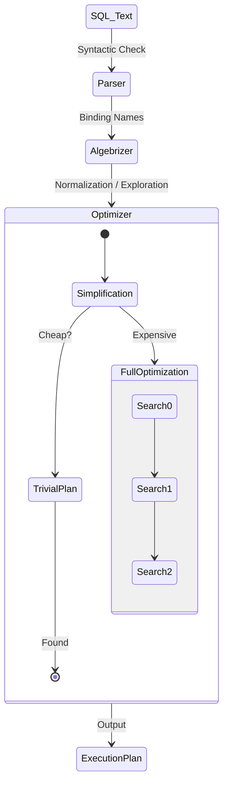

# Module 7: Query Execution and Analysis

## 1. บทนำ (Introduction)
SQL เป็นภาษาแบบ Declarative (กำหนดผลลัพธ์ที่ต้องการ ไม่ใช่ขั้นตอนการทำงาน) หน้าที่ของ **Query Optimizer** คือการคำนวณและสร้างแผนการทำงาน (**Execution Plan**) ที่มีประสิทธิภาพสูงสุด (Lowest Cost)

การวิเคราะห์ Execution Plan เป็นทักษะสำคัญที่ช่วยในการตรวจสอบปัญหาประสิทธิภาพ (Performance Tuning) และเข้าใจพฤติกรรมของ Database Engine

### 1.1 Skill Progression (ทักษะที่ควรได้จาก Module นี้)
- **ระดับ 1 – อ่าน Execution Plan ได้อย่างถูกต้อง**
  - แยก Logical/Physical Operators, เข้าใจ Seek/Scan/Key Lookup, Join Types, และการอ่าน Estimated vs Actual Rows
- **ระดับ 2 – ระบุปัญหาที่มองเห็นจาก Plan**
  - ตรวจพบ Missing Index, Implicit Conversion, Spill, Parallelism ผิดที่ และเชื่อมโยงกับ I/O/CPU จาก DMV/PerfMon ได้
- **ระดับ 3 – ใช้ Live Query Stats และ IQP ช่วยวิเคราะห์ปัญหา**
  - ใช้ Live Query Statistics, `sys.dm_exec_query_profiles`, และฟีเจอร์ Intelligent Query Processing (เช่น Memory Grant Feedback, Scalar UDF Inlining) เพื่อยืนยันสมมติฐาน
- **ระดับ 4 – ออกแบบแนวทาง Tuning ตาม Best Practice**
  - ปรับปรุง Query/Index ให้สอดคล้องกับแนวทางจาก Query Processing Architecture Guide และ Performance Center (โฟกัสที่ Plan Quality ก่อน Scale Hardware) ได้เป็นขั้นตอน

---

## 2. Query Optimizer Internals (Lesson 1)

### 2.1 Logical vs Physical Processing

**Query Optimizer** คือ Component ที่รับผิดชอบในการเลือก **Execution Plan** ที่มี Cost ต่ำที่สุด จาก Plan ที่เป็นไปได้หลายพันแบบ

> **ทำไมสำคัญ?** Query เดียวกันอาจมีหลาย Plan (Index Seek vs Scan, Nested Loop vs Hash Join) ถ้า Optimizer เลือกผิด → Query ช้า 100x-1000x

**กระบวนการ Query Processing:**

```
SQL Text → Parsing → Binding (Algebrizer) → Optimization → Execution
              ↓            ↓                      ↓
         Syntax Check   Name Resolution    Find Best Plan
```

| Phase | หน้าที่ | Output |
|-------|--------|--------|
| **Parsing** | ตรวจสอบ Syntax ของ SQL | Parse Tree |
| **Binding** | เชื่อม Object Names กับ Metadata | Query Tree |
| **Optimization** | คำนวณ Cost, เลือก Plan ดีที่สุด | Execution Plan |
| **Execution** | ดำเนินการตาม Plan | Result Set |

### 2.2 Optimization Phases
Optimizer มีเป้าหมายในการหา "Good Enough Plan" อย่างรวดเร็ว โดยแบ่งขั้นตอนดังนี้:
1.  **Simplification**: การลดรูป Query (เช่น เปลี่ยน Subquery เป็น Join, ตัด Join ที่ไม่จำเป็น)
2.  **Trivial Plan**: สำหรับ Query พื้นฐานที่มีทางเลือกเดียว (เช่น `SELECT * FROM Table` โดยไม่มี Where clause ซับซ้อน)
3.  **Full Optimization**:
    *   *Search 0 (Transaction Processing)*: ค้นหา Plan พื้นฐานสำหรับ Simple OLTP (Cost ต่ำ)
    *   *Search 1 (Quick Plan)*: ประยุกต์ใช้กฎการ Transformation ทั่วไป
    *   *Search 2 (Full Optimization)*: การค้นหาเชิงลึก รวมถึงการพิจารณา Parallelism และ Indexed Views (ใช้ทรัพยากรและเวลามากที่สุด)

### 2.3 Optimization Pipeline (Visualized)


---

## 3. Query Execution Plans (Lesson 2)

### 3.1 Plan Types
*   **Estimated Plan**: แผนการทำงานที่ Optimizer คาดการณ์ (ยังไม่มีการประมวลผลจริง) ใช้สำหรับการตรวจสอบโครงสร้าง Plan
*   **Actual Plan**: แผนการทำงานจริงที่ได้หลังจากการประมวลผล ประกอบด้วย Runtime Statistics (เช่น Actual Rows vs Estimated Rows)

### 3.2 Live Query Statistics (Real-time Plan Analysis)

**Live Query Statistics** คือความสามารถในการดู Execution Plan **ขณะที่ Query กำลังทำงาน** พร้อม Animation แสดง Data Flow แบบ Real-time

> เหมาะสำหรับการติดตาม **Long-running Queries** เพื่อดูว่า Query "ติด" อยู่ที่ Operator ไหน

**วิธีใช้งาน:**

| วิธี | ขั้นตอน |
|------|--------|
| **SSMS Query Window** | คลิก "Include Live Query Statistics" ก่อนรัน Query |
| **Activity Monitor** | คลิกขวาที่ Session → "Show Live Execution Plan" |
| **DMV** | Query `sys.dm_exec_query_profiles` |

```sql
-- ดู Live Statistics ผ่าน DMV
SELECT 
    session_id,
    node_id,
    physical_operator_name,
    row_count,
    estimate_row_count,
    elapsed_time_ms
FROM sys.dm_exec_query_profiles
WHERE session_id = <target_session_id>;
```

> [!NOTE]
> **Lightweight Query Profiling** (SQL 2019+) เปิดใช้งานเป็น Default ทำให้ `sys.dm_exec_query_profiles` มี Overhead ต่ำมาก

### 3.3 Plan Formats
*   **Graphical**: รูปแบบกราฟิก (มาตรฐานใน SSMS) อ่านลำดับการทำงานจากขวาไปซ้าย
*   **XML**: รูปแบบข้อความที่มีความละเอียดสูงสุด (สามารถบันทึกเป็นไฟล์ `.sqlplan`)
*   **Text**: รูปแบบข้อความ (Legacy) ปัจจุบันไม่นิยมใช้เนื่องจากอ่านยาก

### 3.4 Advanced Query Processing Architecture (Microsoft Guide)

1.  **Parallel Query Processing**:
    *   **Exchange Operators**: เมื่อ Query รันแบบ Parallel จะมี Operator พิเศษชื่อ **Exchange** (`Distribute Streams`, `Repartition Streams`, `Gather Streams`) แทรกเข้ามาใน Plan เพื่อจัดการ Data Flow ระหว่าง Threads
    *   **DOP Dynamics**: SQL Server สามารถลด DOP อัตโนมัติได้หาก Thread ไม่พอ (ดู Available Worker Threads)
    *   **Inhibitors**: สิ่งที่ขัดขวาง Parallelism เช่น *Scalar UDFs* (ก่อน 2019), *Recursive CTEs*, *MSTVFs*, *TOP* keyword

2.  **Batch Mode Execution Internals**:
    *   **Vector-based**: ประมวลผลทีละ Batch (Vector) ไม่ใช่ทีละ Row ทำให้ CPU Efficiency สูงมาก (ใช้ CPU Cache ได้คุ้มค่า)
    *   **Hardware Friendly**: ออกแบบมาเพื่อ Modern Multi-Core CPU
    *   *Evolution*: เดิมผูกกับ Columnstore Index แต่ปัจจุบันใช้กับ Rowstore ได้แล้ว (SQL 2019+)

3.  **Distributed Query Architecture**:
    *   SQL Server ใช้ **OLE DB** เป็นสื่อกลางในการคุยกับ External Data Sources (Linked Server)
    *   **Relational Engine** จะแตก Query ออกเป็น operations ย่อยๆ ส่งให้ OLE DB Provider (เช่นอ่าน Rowset)
    *   *Ad-hoc Connector*: ใช้ `OPENROWSET` หรือ `OPENDATASOURCE` สำหรับการเชื่อมต่อชั่วคราว (แต่ต้องระวัง Security และอาจถูกปิดโดย `DisallowAdhocAccess`)

---

## 4. Analyzing Query Plans (Lesson 3)

### 4.1 Common Operators (Data Access)
*   **Index Seek**: การค้นหาข้อมูลโดยใช้ B-Tree Traversal จะมีประสิทธิภาพสูงสุดเมื่อ Predicate มี Selectivity สูง
*   **Index Scan**: การอ่าน Leaf Page ทั้งหมดของ Index (เหมาะสำหรับ Table ขนาดเล็ก หรือ Low Selectivity)
*   **Table Scan**: การอ่านข้อมูลทั้งหมดใน Heap Table (ควรหลีกเลี่ยงใน Table ขนาดใหญ่)
*   **Key Lookup**: การกลับไปอ่านข้อมูลใน Table หลัก (Clustered Index/Heap) เมื่อ Non-Clustered Index ไม่มี Column ที่ต้องการครบถ้วน (Expensive Operation)

### 4.2 Join Operators
*   **Nested Loops**: มีประสิทธิภาพสูงสำหรับ Input ขนาดเล็ก (Outer Loop จำนวนน้อย)
*   **Merge Join**: มีประสิทธิภาพสูงสุดเมื่อ Input ทั้งสองฝั่งมีการเรียงลำดับ (Sorted) แล้ว
*   **Hash Join**: เหมาะสำหรับ Input ขนาดใหญ่ที่ไม่มีการเรียงลำดับ (ต้องใช้ Memory ในการสร้าง Hash Table)

### 4.3 Warnings
*   **Missing Statistics**: Optimizer ขาดข้อมูลสถิติในการประเมิน Cost
*   **Missing Index**: คำแนะนำให้สร้าง Index เพิ่มเติมเพื่อลด I/O Cost
*   **Implicit Conversion**: การแปลง Data Type อัตโนมัติซึ่งอาจปิดกั้นการใช้ Index (Prevent Index Seek)
*   **Spill Warning**: Memory Grant ไม่เพียงพอ ทำให้ต้องเขียนข้อมูลชั่วคราวลง TempDB (ส่งผลกระทบต่อประสิทธิภาพสูง)

---

## 5. Intelligent Query Processing (IQP) (Lesson 4)

**Intelligent Query Processing** คือกลุ่มฟีเจอร์ที่ช่วยปรับปรุง Query Performance **โดยอัตโนมัติ** โดยไม่ต้องแก้ไข Code (Minimal Implementation Effort)

> เปิดใช้งาน IQP โดยตั้งค่า **Compatibility Level** ให้สูงพอ

```sql
-- เปิดใช้ IQP ทั้งหมด (SQL 2022+)
ALTER DATABASE [YourDB] SET COMPATIBILITY_LEVEL = 160;

-- SQL 2025
ALTER DATABASE [YourDB] SET COMPATIBILITY_LEVEL = 170;
```

> [!NOTE]
> **Query Store Requirement**: หลาย Feature ใน IQP ต้องเปิด Query Store (READ_WRITE mode) เพื่อเก็บ Feedback ลง Disk

### 5.1 IQP Features by SQL Server Version

| Feature | 2017 | 2019 | 2022 | 2025 | ต้อง Query Store |
|---------|:----:|:----:|:----:|:----:|:----------------:|
| **Batch Mode Adaptive Joins** | ✅ | ✅ | ✅ | ✅ | ❌ |
| **Batch Mode Memory Grant Feedback** | ✅ | ✅ | ✅ | ✅ | ❌ |
| **Interleaved Execution (MSTVF)** | ✅ | ✅ | ✅ | ✅ | ❌ |
| **Row Mode Memory Grant Feedback** | | ✅ | ✅ | ✅ | ❌ |
| **Table Variable Deferred Compilation** | | ✅ | ✅ | ✅ | ❌ |
| **Scalar UDF Inlining** | | ✅ | ✅ | ✅ | ❌ |
| **Batch Mode on Rowstore** | | ✅ | ✅ | ✅ | ❌ |
| **Approximate Count Distinct** | ✅ | ✅ | ✅ | ✅ | ❌ |
| **Memory Grant Feedback (Persisted)** | | | ✅ | ✅ | ✅ |
| **Parameter Sensitive Plan (PSP)** | | | ✅ | ✅ | ✅ |
| **DOP Feedback** | | | ✅ | ✅ | ✅ |
| **CE Feedback** | | | ✅ | ✅ | ✅ |
| **Optimized Plan Forcing** | | | ✅ | ✅ | ✅ |
| **Optional Parameter Plan (OPPO)** 🆕 | | | | ✅ | ✅ |
| **CE Feedback for Expressions** 🆕 | | | | ✅ | ✅ |

### 5.2 Feature Deep Dive (How it works)

**1. Batch Mode on Rowstore (SQL 2019+)**
*   *Concept*: นำ **Batch Mode Execution** (ประมวลผลทีละ 900 rows) มาใช้กับ Rowstore Index (B-Tree/Heap) ปกติ
*   *Legacy*: เดิมต้องสร้าง Columnstore Index เท่านั้นจึงจะได้ Batch Mode
*   *Benefit*: เร่งความเร็ว Analytical Query (Big Scan + Aggregate) บน OLTP Table ได้โดยไม่ต้องแก้ Index

**2. Scalar UDF Inlining (SQL 2019+)**
*   *Problem*: Scalar UDF ทำงานแบบ **Iterative** (เรียก 1 ครั้งต่อ 1 แถว) และ Optimization ต่ำ
*   *Solution*: SQL Server แปลง UDF เป็น **Relational Expression** หรือ Subquery เพื่อให้ทำงานแบบ **Set-based**
*   *Result*: เร็วขึ้นหลายเท่าตัว และสามารถใช้ Parallelism ได้

**3. Table Variable Deferred Compilation (SQL 2019+)**
*   *Problem*: Table Variable (`@table`) มักถูกประเมินว่ามีแค่ **1 Row** (Fixed Estimate) ทำให้เลือก Plan ผิด
*   *Solution*: ไม่ Compile ทันที แต่รอจนเริ่ม Run (Deferred) เพื่อนับจำนวนแถวจริง (Actual Row Count) ก่อนสร้าง Plan
*   *Note*: ไม่ได้สร้าง Statistics (ต่างจาก Temp Table) แต่ใช้ Cardinality จริงในการ Compile ครั้งแรก

**4. Batch Mode Adaptive Joins (SQL 2017+)**
*   *Concept*: เลือก Join Method (Hash vs Nested Loop) **ในขณะ Runtime**
*   *Mechanism*: สร้าง Plan ที่มี 2 ทางเลือก ถ้าข้อมูลที่ Scan จริง < Threshold → ไป Nested Loop, ถ้า > Threshold → ไป Hash Join

**5. Parameter Sensitive Plan (PSP) (SQL 2022+)**
*   *Problem*: **Parameter Sniffing** ที่ Data Skew สูง (ค่าหนึ่งมี 10 แถว อีกค่ามี 1 ล้านแถว) ทำให้ Plan เดียวไม่พอ
*   *Mechanism*: ใช้ **Dispatcher** ลงใน Plan Cache เพื่อตรวจสอบค่า Parameter ตอน Runtime (Dispatcher Expression)
*   *Query Variants*: สร้าง Plan ย่อย (Variants) แยกตามช่วงข้อมูล (Low, Medium, High Cardinality Ranges)
*   *Result*: Query เดียวกันจะมี **Multiple Cached Plans** ที่เหมาะสมกับแต่ละช่วงข้อมูลโดยอัตโนมัติ

**6. Memory Grant Feedback**
*   *Basic (2017/2019)*: จำว่า Query รอบที่แล้วใช้ Memory **เกิน** (Wasted) หรือ **ขาด** (Spill) และปรับขนาด Grant ในรอบถัดไป (Cached Plan)
*   *Persistence (2022)*: บันทึกข้อมูล Grant ลง **Query Store** ทำให้จำค่าได้แม้ Plan ถูก Cache Evict หรือ Restart Server
*   *Percentile (2022)*: ใช้ข้อมูล **Percentile** จากประวัติหลายๆ ครั้ง เพื่อหาค่า Grant ที่เหมาะสมที่สุดสำหรับ Workload ที่แกว่ง (Oscillating Data Size) ไม่ใช่แค่ดูครั้งล่าสุด

**7. Optional Parameter Plan (OPPO) (SQL 2025)**
*   *Problem*: Pattern `WHERE (@p IS NULL OR col = @p)` มักได้ Plan แบบ **Index Scan** ตลอดเวลา แม้จะระบุค่า @p
*   *Solution*: ใช้กลไก **Multiplan** (Dispatcher) แยก 2 Plan:
    1. กรณี `@p IS NULL` → ใช้ Scan Plan
    2. กรณี `@p IS NOT NULL` → ใช้ Seek Plan
*   *Benefit*: ได้ประสิทธิภาพสูงสุดทั้งสองกรณีโดยไม่ต้องแก้ Code เป็น `IF/ELSE` หรือใช้ `OPTION(RECOMPILE)`

**8. DOP Feedback (SQL 2022+)**
*   *Mechanism*: ตรวจจับ Query ที่มี Parallelism สูงเกินไป (Excessive Parallelism) โดยดูจาก Wait Types
*   *Adjustment*: หากพบปัญหา จะค่อยๆ ลดค่า DOP ลงในการรันครั้งถัดไป (Step-down) และตรวจสอบว่า Performance ดีขึ้นหรือไม่
*   *Validation*: จะหยุดลดเมื่อ Performance เริ่มคงที่ (Stabilized) หรือแย่ลง (Reverted)
*   *Note*: Minimum DOP คือ 2 (ไม่ลดจนเป็น Serial) และเพิกเฉยต่อ Waits ภายนอกเช่น Buffer Latch, Network I/O

**9. CE (Cardinality Estimation) Feedback (SQL 2022+)**
*   *Problem*: CE Model ที่ใช้อาจไม่เหมาะกับข้อมูล (เช่น คาดว่าคอลัมน์สัมพันธ์กันแต่จริงๆ อิสระต่อกัน)
*   *Mechanism*: ตรวจสอบผลลัพธ์จริงเทียบกับที่เดาไว้ (Actual vs Estimated Rows)
*   *Adjustment*: ทดลองเปลี่ยนสมมติฐาน (Model Assumption) ผ่าน **Query Store Hints** เช่น `ASSUME_MIN_SELECTIVITY_FOR_FILTER_ESTIMATES`
*   *Scenarios*: ปรับเรื่อง Correlation (Independence vs Full Correlation) และ Join Containment

**10. CE Feedback for Expressions (SQL 2025)**
*   *Concept*: ขยาย CE Feedback ให้ละเอียดระดับ **Sub-expression** (ไม่ได้เหมาทั้ง Query)
*   *Benefit*: รองรับ Query ที่ไม่ซ้ำ (Ad-hoc) แต่มี **Pattern ของ Expression ซ้ำๆ** (เช่น Join คู่เดิม)
*   *Advanced*: สามารถใช้ CE Model คนละแบบใน Query เดียวกันได้ (เช่น Part A ใช้ Base Containment, Part B ใช้ Simple Containment)

---

## 6. Lab: Analyzing Execution Plans

**[ไปยังคำแนะนำแล็บ](LABS/Lab_Instructions.md)**

ในแล็บนี้ คุณจะระบุปัญหาประสิทธิภาพเช่น Implicit Conversions และเรียนรู้วิธีแก้ไขเพื่อให้ได้ Index Seek กลับคืนมา

---

## 7. Review Quiz (Knowledge Check)

<details>
<summary><b>1. Logical Reads กับ Physical Reads ต่างกันอย่างไร?</b></summary>
Logical Reads คือการอ่านจาก Memory (Buffer Pool) ซึ่งเร็วมาก ส่วน Physical Reads คือการอ่านจาก Disk จริงๆ ซึ่งช้ากว่ามาก
</details>

<details>
<summary><b>2. Key Lookup (Bookmark Lookup) คืออะไร และทำไมถึงส่งผลเสีย?</b></summary>
คือ operations ที่ต้องกระโดดจาก Non-Clustered Index กลับไปอ่านข้อมูลฉบับเต็มที่ Clustered Index (Heap) เนื่องจาก NCI ไม่มี Column ที่ต้องการครบ ถ้าทำเยอะๆ จะเปลือง I/O มหาศาล
</details>

<details>
<summary><b>3. Implicit Conversion คืออะไร?</b></summary>
การแปลง Data Type โดยอัตโนมัติเนื่องจาก Type ไม่ตรงกัน (เช่นเทียบ `VARCHAR` กับ `NVARCHAR`) ซึ่งมักจะทำให้ใช้ Index ไม่ได้ (Index Scan แทน Seek)
</details>

