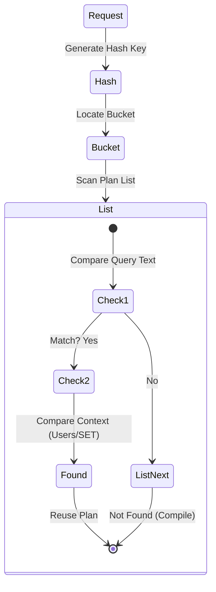
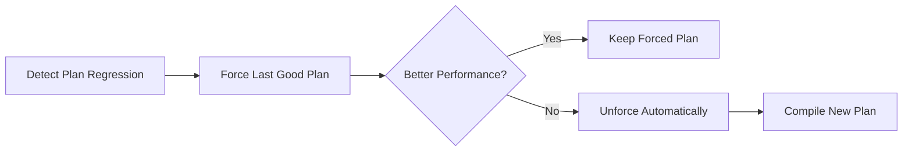

# Module 8: Plan Caching and Query Store

## 1. บทนำ (Introduction)
กระบวนการ Compile Query เพื่อสร้าง Execution Plan เป็นขั้นตอนที่ใช้ทรัพยากร CPU สูง SQL Server จึงมีการจัดเก็บ Plan ไว้ใน Memory ส่วนที่เรียกว่า **Plan Cache** เพื่อนำกลับมาใช้ซ้ำ (Reuse) อย่างไรก็ตาม การจัดการ Plan Cache ที่ไม่มีประสิทธิภาพอาจนำไปสู่ปัญหา Memory Pressure หรือ Plan Regression ได้

ในบทเรียนนี้ ผู้เรียนจะศึกษาโครงสร้างของ Plan Cache, กลไกการ Recompilation, และฟีเจอร์สมัยใหม่อย่าง Query Store

### 1.1 Skill Progression (ทักษะที่ควรได้จาก Module นี้)
- **ระดับ 1 – เข้าใจกลไก Plan Cache**
  - อธิบาย Compiled/Executable Plan, Cache Stores, การ Lookup/Eviction และผลของ Ad-hoc Plan Pollution ได้
- **ระดับ 2 – ตรวจสอบปัญหาจาก Plan Cache**
  - ใช้ DMV และ Counters (`SQL Compilations/sec`, `Recompilations/sec`, ขนาด CACHESTORE_SQLCP/OBJCP) เพื่อระบุ Plan Bloat, Recompile สูงผิดปกติ และ Parameter Sniffing ได้
- **ระดับ 3 – ใช้ Query Store ในการวิเคราะห์ย้อนหลัง**
  - เปิด/ตั้งค่า Query Store อย่างปลอดภัย, ใช้รายงาน Top Resource Queries, Regressed Queries, และ Plan Forcing เพื่อแก้ปัญหาเร่งด่วนได้
- **ระดับ 4 – ประยุกต์ Automatic Tuning & Feedback Loops**
  - เปิดใช้ Automatic Plan Correction, Persistent Memory Grant/DOP/CE Feedback ใน SQL Server 2017–2022+ และเชื่อมโยงกับแนวทาง Performance Center ในหัวข้อ Query Performance Options ได้

---

## 2. Plan Cache Internals (Lesson 1)

### 2.1 How it works

**Plan Cache** คือพื้นที่ใน Memory ที่ SQL Server ใช้เก็บ **Execution Plans** ที่ถูก Compile แล้ว เพื่อใช้ซ้ำเมื่อมี Query เดียวกันเข้ามาอีก ลดการใช้ CPU ในการ Compile ซ้ำ

> การ Compile Query ใช้ CPU สูง ดังนั้น "ยิ่งใช้ Plan ซ้ำได้มากเท่าไร ยิ่งประหยัด CPU"

**สถาปัตยกรรม Plan Cache:**

```
Query เข้ามา → Hash Query Text → ค้นหาใน Cache Bucket
                                      ↓
                        [พบ Plan?] ─Yes→ ใช้ซ้ำ (Cache Hit)
                                      ↓ No
                        Optimize & Compile → เก็บลง Cache → Execute
```

**ประเภทของ Plan:**
*   **Compiled Plan**: แผนการทำงานต้นแบบ (Generic Structure) สามารถแชร์ข้าม Users ได้
*   **Executable Plan (Context)**: Instance ของ Plan ที่ผูกกับ User/Parameter เฉพาะ พร้อมใช้งานทันที

### 2.2 Plan Lookup Flow (Visualized)


### 2.2 Cache Stores
Cache Store คือพื้นที่หน่วยความจำที่แบ่งแยกตามประเภทของ Plan:
1.  **Object Plans (CACHESTORE_OBJCP)**: สำหรับ Stored Procedures, Functions, และ Triggers (มีความน่าจะเป็นในการใช้ซ้ำสูง)
2.  **SQL Plans (CACHESTORE_SQLCP)**: สำหรับ Ad-hoc Queries และ Prepared Statements
3.  **Bound Trees (CACHESTORE_PHDR)**: โครงสร้าง Algebra trees ของ Views และ Constraints
4.  **Extended Stored Procedures (CACHESTORE_XPROC)**: สำหรับ Extended Stored Procedures

### 2.3 Management & Eviction
เนื่องจาก Memory มีจำกัด SQL Server จึงมีกลไก Loop Eviction เพื่อลบ Plan ที่ไม่จำเป็นออก:
*   **Memory Pressure**: แรงกดดันด้านหน่วยความจำ (ทั้ง Local Store pressure และ Global Server pressure)
*   **Cost-based Eviction**: อัลกอริทึม Clock Hand จะตรวจสอบ "Cost" ของ Plan หาก Plan ใดไม่มีการใช้งานเป็นเวลานาน Cost จะลดลงจนเป็น 0 และถูกลบออกจาก Cache
*   **Manual**: คำสั่ง `DBCC FREEPROCCACHE` (ควรใช้ด้วยความระมัดระวังสูงสุดใน Production Enviromnment)

### 2.4 Minimizing Plan Bloat
*   **Auto-parameterization**: SQL Server พยายามแปลง Literal Value เป็น Parameter อัตโนมัติ (เฉพาะ Simple Query)
*   **Optimize for Ad-hoc Workloads**: ตัวเลือก configuration ระดับ Server
    *   *Mechanism*: ในการรันครั้งแรกจะเก็บเพียง "Compiled Plan Stub" (ขนาดเล็ก)
    *   *Second Run*: หากมีการเรียกใช้ซ้ำ จึงจะทำการเก็บ Full Plan
    *   *Benefit*: ลดการใช้ Memory จาก Single-use Ad-hoc queries ลงได้อย่างมหาศาล

### 2.5 Deep Dive: Plan Caching Architecture (Microsoft Guide)

1.  **Compilation Process (Lifecycle)**:
    *   **Parser**: ตรวจสอบ Validate Syntax (ถ้าผิด จะไม่เกิด Plan)
    *   **Algebrizer**: Resolve Names (ผูกชื่อ Table/Column) -> Output เป็น *Query Processor Tree*
    *   **Optimizer**: **Trivial Plan** (ง่ายๆ ไม่ต้องคิดเยอะ) vs **Full Optimization** (คำนวณ Cost ละเอียด)
    *   **Execution**: นำ Plan ไปรันจริง

2.  **Plan Cache Internals**:
    *   **Query Hash**: Fingerprint ของ Code (ไม่สนค่า Parameter) ใช้จัดกลุ่ม Query ที่หน้าตาเหมือนกัน
    *   **Query Plan Hash**: Fingerprint ของ Execution Plan ใช้ดูว่า Code เดียวกันได้ Plan เหมือนกันไหม (ถ้าต่าง = Parameter Sniffing)

3.  **Simple vs Forced Parameterization**:
    *   **Simple (Safe)**: SQL ทำเองเฉพาะ Query ง่ายๆ (เช่น `WHERE ID = 1`)
    *   **Forced (Aggressive)**: บังคับเปลี่ยนทุก Literal เป็น Parameter (ผ่าน Database Setting) -> ลด Compilation ได้ดีมาก แต่อาจทำให้เกิด Parameter Sniffing รุนแรงได้

---

## 3. Troubleshooting with Plan Cache (Lesson 2)

### 3.1 Recompilation
กระบวนการสร้าง Plan ใหม่แทนที่ Plan เดิมที่อยู่ใน Cache
*   **Impact**: หากเกิดขึ้นบ่อยเกินไป (Frequent Recompilation) จะส่งผลกระทบต่อ CPU Usage
*   **Causes**: Schema changes, Statistics update, `SET` option changes, หรือการใช้ `OPTION(RECOMPILE)`
*   **Monitoring**: ตรวจสอบ counter `SQL Recompilations/sec` ใน Performance Monitor

### 3.2 Parameter Sniffing
ปรากฏการณ์ที่ Execution Plan ถูกสร้างขึ้นตามค่า Parameter ค่าแรกที่ส่งเข้ามา (Sniffed Value)
*   *Scenario*: Plan ที่เหมาะสมกับ Parameter A (Data น้อย -> Seek) ถูกนำไปใช้กับ Parameter B (Data มาก -> ควรจะเป็น Scan) ทำให้ประสิทธิภาพลดลง
*   *Solution*: การใช้ `OPTION(RECOMPILE)`, `OPTIMIZE FOR UNKNOWN`, หรือการทำ Plan Forcing ผ่าน Query Store

### 3.3 Plan Cache Bloat (Ad-hoc Plan Pollution)
อาการ: Memory ของ `CACHESTORE_SQLCP` มีขนาดใหญ่ผิดปกติ เต็มไปด้วย Single-use Plans
*   *Solution*: ปรับปรุง Application Code ให้ใช้ Parameterized Query หรือเปิดใช้งาน Server Option 'Optimize for Ad-hoc Workloads'

---

## 4. Query Store (Lesson 3)

**Query Store** คือระบบบันทึกประวัติ **Query Plans** และ **Runtime Statistics** ลงใน Database โดยอัตโนมัติ ช่วยให้สามารถวิเคราะห์ Performance ย้อนหลังและตรวจจับ Plan Regression ได้

> เปรียบเสมือน "Black Box" หรือ **Flight Data Recorder** ของ Database ที่บันทึกทุก Query ที่เกิดขึ้น

> [!IMPORTANT]
> **Query Store เป็น Foundation** สำหรับ Automatic Tuning และ Intelligent Query Processing ควรเปิดใช้งานก่อนเสมอ

### 4.1 Query Store Architecture

```
┌─────────────────────────────────────────────────────┐
│                    Query Store                       │
│  ┌──────────────┐  ┌──────────────┐  ┌───────────┐  │
│  │ Query Text   │  │ Query Plans  │  │ Runtime   │  │
│  │ (sys.query_  │  │ (sys.query_  │  │ Stats     │  │
│  │ store_query) │  │ store_plan)  │  │ (interval)│  │
│  └──────────────┘  └──────────────┘  └───────────┘  │
│                         ↓                            │
│  ┌──────────────────────────────────────────────┐   │
│  │ Wait Stats (SQL 2017+)                        │   │
│  │ Query Store Hints (SQL 2022+)                 │   │
│  └──────────────────────────────────────────────┘   │
└─────────────────────────────────────────────────────┘
```

### 4.2 Key Use Cases

| Use Case | วิธีใช้ | ประโยชน์ |
|----------|-------|---------|
| **Regression Detection** | เปรียบเทียบ Plan ก่อน/หลัง | หา Query ที่ช้าลงหลัง Upgrade |
| **Plan Forcing** | บังคับใช้ Plan ที่ดี | แก้ปัญหา Parameter Sniffing |
| **Top Resource Consumers** | Sort by CPU/Duration/Reads | หา Query ที่กิน Resource มากสุด |
| **Query Wait Analysis** | ดู Wait Stats ต่อ Query | หาว่า Query ติด Wait อะไร |

### 4.3 Configuration Best Practices

```sql
-- เปิดใช้งาน Query Store
ALTER DATABASE [YourDB] SET QUERY_STORE = ON;

-- ตั้งค่าที่แนะนำ
ALTER DATABASE [YourDB] SET QUERY_STORE (
    OPERATION_MODE = READ_WRITE,
    CLEANUP_POLICY = (STALE_QUERY_THRESHOLD_DAYS = 30),
    DATA_FLUSH_INTERVAL_SECONDS = 900,
    INTERVAL_LENGTH_MINUTES = 60,
    MAX_STORAGE_SIZE_MB = 1000,
    QUERY_CAPTURE_MODE = AUTO,
    SIZE_BASED_CLEANUP_MODE = AUTO
);
```

### 4.4 Plan Forcing (แก้ไขปัญหาเร่งด่วน)

```sql
-- บังคับใช้ Plan ที่ดี
EXEC sp_query_store_force_plan @query_id = 123, @plan_id = 456;

-- ยกเลิกการบังคับ
EXEC sp_query_store_unforce_plan @query_id = 123, @plan_id = 456;
```

> [!WARNING]
> Plan Forcing เป็นการแก้ปัญหาชั่วคราว ควรหาสาเหตุที่แท้จริง (เช่น Statistics, Index) และแก้ไขที่ต้นเหตุ

---

## 5. Automatic Tuning Evolution (2017 - 2025) (Lesson 4)

**Automatic Tuning** คือกระบวนการ **Continuous Monitoring** ที่เรียนรู้ Workload อย่างต่อเนื่อง และปรับปรุง Performance โดยอัตโนมัติ

> [!NOTE]
> **Prerequisite**: ต้องเปิด Query Store ก่อนใช้งาน Automatic Tuning

### 5.1 Phase 1: Force Last Good Plan (SQL 2017+)

มุ่งเน้นการแก้ไขปัญหา **Plan Regression** (ประสิทธิภาพลดลงหลังจากการเปลี่ยน Plan)

**เงื่อนไขการ Force Plan อัตโนมัติ:**

| Condition | Threshold |
|-----------|-----------|
| CPU Gain | > **10 seconds** |
| Error Count | Plan ใหม่ > Plan เก่า |

```sql
-- เปิดใช้งาน Automatic Plan Correction
ALTER DATABASE [YourDB] SET AUTOMATIC_TUNING (FORCE_LAST_GOOD_PLAN = ON);

-- ตรวจสอบ Recommendations
SELECT * FROM sys.dm_db_tuning_recommendations;
```

**กระบวนการ Verification:**



> [!IMPORTANT]
> **Best Use Case**: เปิดใช้หลังทำ **Database Compatibility Level Upgrade** เพื่อลดความเสี่ยง Regression

### 5.2 Phase 2: Index Management (Azure SQL Database Only)

ความสามารถบน Cloud Platform (PaaS) ในการจัดการ Index โดยใช้ Machine Learning:

| Action | รายละเอียด | Validation |
|--------|-----------|------------|
| **Create Index** | สร้าง Index เมื่อพบ Query ที่ขาด Index | ตรวจสอบหลังสร้าง |
| **Drop Index** | ลบ Index ที่ไม่ใช้ (Unused/Duplicate) | ตรวจสอบก่อนลบ |

*   หากสร้าง Index แล้วประสิทธิภาพลดลง → **Revert อัตโนมัติ**

### 5.3 Phase 3: Intelligent Feedback Loop (SQL 2022 - 2025)

การทำงานร่วมกันระหว่าง **Query Store** และ **Next-Gen Query Processor** เพื่อบันทึกข้อมูลการจูนลง Disk (Persisted Feedback)

| Feedback Type | ปัญหาที่แก้ | Persist เมื่อไร |
|--------------|------------|----------------|
| **DOP Feedback** | Query ใช้ Parallelism มากเกินไป | SQL 2022+ |
| **CE Feedback** | Cardinality Estimation ผิด | SQL 2022+ |
| **Memory Grant Feedback** | Spill หรือ Wasted Memory | SQL 2019+ (Persisted 2022+) |
| **Optimized Plan Forcing** | Compilation Overhead สูง | SQL 2022+ |

---

## 6. Lab: Analyzing Plan Cache Issues

**[ไปยังคำแนะนำแล็บ](Labs/README.md)**

ในแล็บนี้ คุณจะจำลองปัญหา Parameter Sniffing และแก้ไขโดยใช้ Recompilation hints และ Query Store Plan Forcing

---

## 7. Review Quiz (Knowledge Check)

<details>
<summary><b>1. Parameter Sniffing คืออะไร?</b></summary>
ปรากฏการณ์ที่ SQL Server สร้าง Plan ตามค่า Parameter ครั้งแรกที่รัน ซึ่งอาจจะไม่เหมาะกับ Parameter ค่าอื่นในอนาคต (เช่น ครั้งแรก Data น้อย ได้ Nested Loop แต่ครั้งถัดไป Data เยอะ ก็ยังใช้ Nested Loop จนช้า)
</details>

<details>
<summary><b>2. ข้อดีของ Query Store คืออะไร?</b></summary>
เปรียบเสมือนกล่องดำบันทึกการบิน (Flight Recorder) ที่เก็บประวัติ Plan และ Performance ย้อนหลัง ทำให้เราสามารถ Force Plan เก่าที่ดีกว่ากลับมาใช้ได้เมื่อเกิดปัญหา
</details>

<details>
<summary><b>3. ทำไมเราไม่ควรใช้ DBCC FREEPROCCACHE บ่อยๆ?</b></summary>
เพราะการล้าง Cache จะทำให้ CPU Spike เนื่องจากต้อง Compile Query ใหม่ทั้งหมด (Compilation Storm) และเสีย Disk I/O เพื่ออ่าน Metadata ใหม่
</details>

