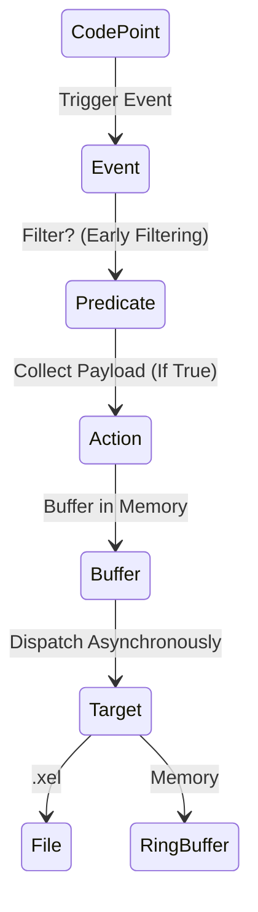

# Module 9: Extended Events (XEvents)

## 1. บทนำ (Introduction)
ในอดีตนิยมใช้ SQL Profiler ในการตรวจสอบการทำงานของ Database แต่เนื่องจากข้อจำกัดด้าน Performance (High Overhead) และความยืดหยุ่น ปัจจุบัน Microsoft แนะนำให้ใช้งาน **Extended Events (XEvents)** ซึ่งเป็นสถาปัตยกรรม Lightweight Tracing System ที่ฝังอยู่ใน SQLOS โดยตรง

บทเรียนนี้จะอธิบายโครงสร้างพื้นฐานของ Extended Events และเปรียบเทียบกับเครื่องมือรุ่นเก่า

### 1.1 Skill Progression (ทักษะที่ควรได้จาก Module นี้)
- **ระดับ 1 – เข้าใจ Architecture ของ XEvents**
  - อธิบายความแตกต่าง Profiler vs XEvents, Components หลัก (Event/Action/Predicate/Target/Session) ได้
- **ระดับ 2 – สร้าง Session พื้นฐานได้**
  - สร้าง XEvent Session เพื่อจับ Long-running Queries, Errors, Deadlocks, Wait Info ลง Ring Buffer หรือ File ตาม Scenario
- **ระดับ 3 – ใช้ XEvents ในการแก้ปัญหาจริง**
  - อ่าน/แปลไฟล์ `.xel`, ใช้ XEvent Profiler/SSMS UI และ DMV (`sys.dm_xe_sessions`, `sys.dm_xe_session_targets`) เพื่อติดตามเหตุการณ์ในระบบได้อย่างปลอดภัย
- **ระดับ 4 – ออกแบบ Tracing Strategy ตามแนวทาง Microsoft**
  - วางแผน Session ระยะยาว/เฉพาะกิจให้สอดคล้องกับ Best Practices ด้าน Monitoring & Tracing ที่อ้างถึงใน Performance Center และ Monitoring Guides (ลด Overhead, เน้น Early Filtering)

---

## 2. Extended Events Core Concepts (Lesson 1)

### 2.1 The Legacy vs Modern

**Extended Events (XEvents)** คือ Framework สำหรับ Tracing และ Debugging ใน SQL Server ที่ออกแบบมาให้มี Overhead ต่ำกว่า SQL Trace/Profiler แบบเดิม

> **ทำไมต้องเปลี่ยนจาก Profiler?** Profiler เป็น Synchronous และมี Overhead สูง (อาจถึง 30%) ในขณะที่ XEvents เป็น Asynchronous และมี Overhead ต่ำมาก (<1%)

**เปรียบเทียบสถาปัตยกรรม:**

| Feature | SQL Trace/Profiler | Extended Events |
|---------|-------------------|-----------------|
| Overhead | สูง (Synchronous) | ต่ำ (Asynchronous) |
| Filtering | หลังเก็บข้อมูล | **ก่อนเก็บ** (Early Filtering) |
| Target Types | Trace File เท่านั้น | หลากหลาย (Ring Buffer, File, Histogram) |
| Status | **Deprecated** | Recommended |

### 2.2 Architecture
XE Engine ประกอบด้วยองค์ประกอบหลักดังนี้:
1.  **Packages**: คอนเทนเนอร์สำหรับเก็บ Metadata ของ Events (เช่น `package0` สำหรับ System Objects, `sqlserver` สำหรับ Database Engine)
2.  **Events**: จุดตรวจสอบ (Instrumentation Points) ที่น่าสนใจภายใน Code ของ SQL Server (เช่น `lock_acquired`, `sql_statement_completed`)
3.  **Predicates**: เงื่อนไขการกรอง (Filters) ที่ทำงานในระดับ Engine *ก่อน* การเก็บข้อมูล (Early Filtering) -> ช่วยลด Overhead ได้อย่างมหาศาล
4.  **Actions**: ข้อมูลเสริม (Global Fields) ที่ต้องการเก็บเพิ่มเติม (เช่น `sql_text`, `plan_handle`) *Note: มี Cost ในการประมวลผลเพิ่ม*
5.  **Targets**: ปลายทางสำหรับการจัดเก็บข้อมูล (Consumers)
6.  **Sessions**: การกำหนดค่า (Configuration) เพื่อเชื่อมโยง Events, Predicates, และ Targets เข้าด้วยกัน

#### XEvent Packages (รายละเอียด)

| Package | Description | Common Events |
|---------|-------------|---------------|
| `package0` | Core system objects | Types, Maps, Actions |
| `sqlserver` | Database Engine events | `sql_statement_completed`, `rpc_completed`, `error_reported` |
| `sqlos` | SQL OS / Scheduling | `wait_info`, `scheduler_monitor_*` |
| `sqlclr` | CLR Integration | CLR-related events |
| `SecAudit` | Security Audit | Audit events |
| `XtpCompile` | In-Memory OLTP | Hekaton compilation events |
| `QueryExecution` | Query Processing | Plan-related events |

#### Useful Events for Performance Tuning

| Event | Purpose | Use Case |
|-------|---------|----------|
| `sql_statement_completed` | Query execution finished | Query performance analysis |
| `rpc_completed` | Stored procedure call finished | SP performance analysis |
| `lock_acquired` / `lock_deadlock` | Locking events | Blocking/Deadlock analysis |
| `sql_statement_recompile` | Plan recompilation | Recompile troubleshooting |
| `wait_info` | Wait statistics | Real-time wait analysis |
| `error_reported` | Error occurred | Error monitoring |
| `query_post_execution_showplan` | Actual execution plan | Plan capture (High overhead!) |

> [!WARNING]
> **High-Overhead Events:**
> - `query_post_execution_showplan` - ดึง Actual Plan ทุก Query (ใช้กับ Production อย่างระวัง!)
> - ใช้ `query_plan_profile` (SQL 2019+) ที่มี Lightweight Query Profiling แทน

### 2.3 Types and Maps
*   **Types**: ประเภทข้อมูลของ Field (เช่น int32, unicode_string)
*   **Maps**: การแปลงค่ารหัสตัวเลขภายใน (Internal ID) ให้เป็นข้อความที่มนุษย์อ่านเข้าใจ (Description) เช่น แปลง `WaitType=120` เป็นชื่อ Wait Type

### 2.4 Deep Dive: XEvent Engine Internals (Microsoft Architecture)

1.  **The Dispatcher**:
    *   หัวใจสำคัญของความ Lightweight คือ **Dispatcher**
    *   *Mechanism*: เมื่อ Event เกิดขึ้น Thread ที่รัน Query จะแค่ "เขียนข้อมูลลง Memory Buffer" (เร็วมาก) แล้วกลับไปทำงานต่อทันที
    *   *Background Thread*: จะมี Dispatcher Thread ภายใน Engine คอยตื่นมาดึงข้อมูลจาก Buffer ไปเขียนลง Target (File/Ring Buffer) ในภายหลัง
    *   *Result*: User Transaction ไม่ต้องรอ I/O (Asynchronous)

2.  **Event Loss Policy**:
    *   เนื่องจาก XEvent ทำงานแบบ Async จึงมีโอกาสที่ Buffer เต็มแล้วเขียนไม่ทัน เราต้องเลือก Policy:
        *   **Single Event Loss**: Buffer เต็มให้ทิ้ง Event (Default, ปลอดภัยสุด)
        *   **Multiple Event Loss**: ทิ้งทั้ง Buffer
        *   **No Event Loss**: บังคับให้ User Thread รอ (Blocking) จนกว่า Buffer จะว่าง -> **อันตราย!** อาจทำให้ระบบช้าลงเหมือน SQL Trace

3.  **Global State Data**:
    *   Actions (เช่น `sql_text`, `username`) เป็นการดึงข้อมูล Global State ซึ่งอาจมี Cost สูงกว่าการเก็บ Payload ปกติ ควรเลือกใช้เท่าที่จำเป็น

### 2.5 XEvent Architecture Diagram (Visualized)

---

---

## 3. Working with Extended Events (Lesson 2)

### 3.1 Configuring Targets
*   **Event File (.xel)**: บันทึกลง Disk (Asynchronous) เหมาะสำหรับการเก็บข้อมูลระยะยาว (Long-term retention) หรือปริมาณมาก
*   **Ring Buffer**: บันทึกลง Memory แบบ FIFO (First-In, First-Out) เหมาะสำหรับการตรวจสอบเบื้องต้น (Ad-hoc monitoring) *ข้อควรระวัง: ข้อมูลอาจสูญหายได้ง่าย*
*   **Histogram (Bucketing)**: การจัดกลุ่มและนับจำนวนเหตุการณ์ใน Memory (Aggregation) เช่น การนับจำนวน Deadlock แยกตาม Database
*   **Event Pairing**: การจับคู่ Event เริ่มต้นและสิ้นสุดเพื่อค้นหา Incomplete Transactions

### 3.2 The system_health Session
Default Session ที่รันอยู่ตลอดเวลา (Always-on) เพื่อบันทึกข้อมูลสุขภาพของระบบที่สำคัญ:
*   *Deadlocks*: บันทึก Deadlock Graph output
*   *Severe Errors*: บันทึก Error ที่มีความรุนแรง (Severity >= 20)
*   *Long Waits*: การรอทรัพยากรที่นานผิดปกติ (> 15s/30s)
*   *Memory*: ปัญหา Memory Allocation Failures

### 3.3 Usage Scenarios
*   **Execution Time-outs**: ตรวจสอบโดยจับคู่ `sql_statement_starting` และ `completed` หรือใช้ `rpc_completed` ที่มี `result = 2` (Abort)
*   **Errors**: จับ Event `error_reported` เพื่อตรวจสอบ Error ที่อาจถูกละเลยโดย Application (Swallowed Errors)
*   **Recompilations**: จับ `sql_statement_recompile` ร่วมกับ Histogram เพื่อระบุ Object ที่เกิด Recompile บ่อยที่สุด

### 3.4 Modern Extended Events (2017+) (Lesson 3)
เครื่องมือและฟีเจอร์ใหม่ที่เพิ่มความสะดวกในการใช้งาน

#### 1. XEvent Profiler (SSMS 17.3+)
เครื่องมือที่ผสานประสบการณ์ผู้ใช้ (UX) ของ SQL Profiler เข้ากับประสิทธิภาพของ Extended Events
*   *Usage*: SSMS -> Object Explorer -> XE Profiler -> Standard
*   *Benefit*: สามารถดูข้อมูลแบบ Live Stream (Live Watch) ได้โดยมี Overhead ต่ำ

#### 2. Lightweight Query Profiling
โครงสร้างพื้นฐานใหม่สำหรับการติดตาม Query Execution
*   *Legacy*: Event `query_post_execution_showplan` มีผลกระทบต่อประสิทธิภาพสูง (High Performance Overhead)
*   *Modern*: Event `query_thread_profile` ใช้งาน Infrastructure ใหม่ที่มีความเบา (Lightweight)
*   *Live Query Stats*: ช่วยให้สามารถดูความคืบหน้าของ Query ได้แบบ Real-time (เป็น Default ใน SQL Server 2019+)

#### 3. Azure SQL Integration
บน Cloud เราไม่มี Local Drive ให้เขียนไฟล์ .xel
*   *Target*: ต้องเขียนลง **Azure Blob Storage** แทน
*   *Analysis*: โหลดไฟล์ .xel จาก Blob มาเปิดใน SSMS เครื่องเราได้เลย

---

## 6. Lab: Troubleshooting with XEvents
**[ไปยังคำแนะนำแล็บ](LABS/Lab_Instructions.md)**

ในแล็บนี้ คุณจะกำหนดค่า XEvent session เพื่อจับ Wait Stats และ Deadlocks จากนั้นวิเคราะห์ผลลัพธ์

---

## 7. Review Quiz (Knowledge Check)

<b>1. ข้อดีหลักของ XEvents เมื่อเทียบกับ SQL Profiler คืออะไร?</b>

Lightweight และ Scalable กว่า มีผลกระทบต่อเครื่องน้อยกว่ามาก เพราะมีสถาปัตยกรรมแบบ Asynchronous และ Buffering

<b>2. Predicate คืออะไร และทำไมถึงสำคัญ?</b>

คือเงื่อนไขการกรอง (Filter) ที่ทำงานก่อนเก็บข้อมูล (Early Filtering) ช่วยลด Overhead และลดขนาดข้อมูลที่ไม่จำเป็นต้องบันทึกได้อย่างมหาศาล

<b>3. target แบบ Ring Buffer มีข้อควรระวังคืออะไร?</b>

ข้อมูลเก็บใน Memory แบบวงกลม (FIFO) ถ้ามี Event เข้ามาเยอะ ข้อมูลเก่าจะถูกเขียนทับหายไป จึงไม่เหมาะกับการเก็บข้อมูลระยะยาว

