# Module 10: Monitoring, Tracing, and Baselines

## 1. บทนำ (Introduction)
การเฝ้าระวัง (Monitoring) และการสร้างฐานข้อมูลเปรียบเทียบ (Baselining) เป็นขั้นตอนพื้นฐานที่สำคัญที่สุดในการบริหารจัดการประสิทธิภาพ หากปราศจาก Baseline ที่ดี ผู้ดูแลระบบจะไม่สามารถระบุได้ว่าพฤติกรรมปัจจุบันของระบบนั้น "ผิดปกติ" หรือไม่

### 1.1 Skill Progression (ทักษะที่ควรได้จาก Module นี้)
- **ระดับ 1 – เข้าใจเครื่องมือและ DMVs สำคัญสำหรับ Monitoring**
  - แยก Snapshot DMV vs Cumulative DMV, เข้าใจบทบาทของ PerfMon, Ring Buffers, Activity Monitor, XEvents เบื้องต้น
- **ระดับ 2 – สร้างและอ่าน Baseline ได้**
  - ออกแบบ Data Collector/Job ที่เก็บ CPU/Memory/Disk/Waits ตามช่วงเวลา, อ่านค่าเทียบ Baseline เพื่อแยก “ปกติ” กับ “ผิดปกติ” ได้
- **ระดับ 3 – ใช้ Performance Center ของ Microsoft เป็น Checklist**
  - เชื่อมโยงสิ่งที่ Monitor กับหมวดหมู่ใน [Performance Center for SQL Server Database Engine and Azure SQL Database](https://learn.microsoft.com/en-us/sql/relational-databases/performance/performance-center-for-sql-server-database-engine-and-azure-sql-database?view=sql-server-ver17) เช่น Configuration, Query Performance Options, Monitoring/Tuning Guides ได้
- **ระดับ 4 – ออกแบบ Monitoring & Alerting Strategy สำหรับองค์กร**
  - เลือก Metrics/Threshold ที่เหมาะกับ Workload ของตนเอง, ผูกกับเครื่องมือภายนอก (เช่น SCOM, Azure Monitor, Grafana/Prometheus) และกำหนด Runbook การตอบสนองเมื่อเกิด Alert อย่างเป็นระบบ

---

## 2. Monitoring and Tracing (Lesson 1)

### 2.1 Dynamic Management Objects (DMOs)

**DMOs** คือชุดของ System Views และ Functions ที่ให้ข้อมูลสถานะ Real-time ของ SQL Server ช่วยให้เราเห็นว่า "ตอนนี้เกิดอะไรขึ้นภายใน Engine"

> **หลักการ:** DMOs แบ่งเป็น 2 ประเภท - **Snapshot DMVs** (สถานะปัจจุบัน) และ **Cumulative DMVs** (สถิติสะสมตั้งแต่ Restart)

**DMOs ที่ใช้บ่อยที่สุด:**

| DMO | หน้าที่ | Reset เมื่อไร |
|-----|-------|--------------|
| `sys.dm_exec_requests` | Query กำลังทำงาน + Wait Status | Snapshot |
| `sys.dm_os_wait_stats` | Wait Stats สะสม | SQL Restart / DBCC SQLPERF |
| `sys.dm_io_virtual_file_stats` | I/O Latency ต่อไฟล์ | SQL Restart |
| `sys.dm_db_index_physical_stats` | Index Fragmentation | On-demand |

| `sys.dm_db_index_physical_stats` | Index Fragmentation | On-demand |

### 2.2 Deep Dive: Monitoring Architecture (Internal Mechanics)

1.  **DMV Implementation (User Mode vs Kernel Mode)**:
    *   **SQLOS DMV**: (เช่น `sys.dm_os_schedulers`) ดึงข้อมูลโดยตรงจาก Memory Structure ของ SQL Server เอง (เร็วมาก User Mode)
    *   **Kernel DMV**: (เช่น `sys.dm_io_virtual_file_stats`) ต้องร้องขอข้อมูลจาก Windows OS (Context Switch to Kernel Mode) -> อาจมี Overhead เล็กน้อยถ้าเรียกถี่เกินไป

2.  **PerfMon Architecture (Shared Memory)**:
    *   Performance Counter ไม่ได้ดึงข้อมูลจาก SQL โดยตรง แต่ SQL Server จะเขียนค่าลง **Shared Memory** ของ Windows เป็นระยะ
    *   *Result*: เมื่อเราเปิด PerfMon ยิงไปที่ SQL เรากำลังอ่านจาก Shared Memory นั้น ไม่ได้ไปกวน Database Engine โดยตรง (Low Overhead)

3.  **Ring Buffers**:
    *   SQL Server มี "Black Box" บันทึกเหตุการณ์สำคัญ (Error, Memory Broker, Scheduler Monitor) ลงใน Memory แบบวนทับ (Ring Buffer)
    *   *Use Case*: ใช้ดูปัญหาย้อนหลังได้แม้ไม่ได้เปิด Trace แต่ข้อมูลอาจหายเร็วถ้า Event เยอะ

### 2.3 Windows Performance Monitor (PerfMon)
เครื่องมือระดับ OS สำหรับตรวจสอบการใช้ทรัพยากร (Resource Usage):
*   **CPU**: `Processor(_Total)\% Processor Time` (ควรต่ำกว่า 80% โดยเฉลี่ย)
*   **Memory**: `Available MBytes` (หน่วยความจำเหลือใช้) และ `Page Life Expectancy` (ประสิทธิภาพ Buffer Pool)
*   **Disk**: `Avg. Disk sec/Read` (ค่า Latency, ควรต่ำกว่า 10-15ms)

### 2.3 Other Monitoring Tools
*   **Activity Monitor**: Dashboard พื้นฐานใน SSMS สำหรับดูภาพรวม (Process, Waits, I/O)
*   **Extended Events (XEvents)**: เครื่องมือ Tracing สมัยใหม่ที่เข้ามาทดแทน SQL Profiler (Low Overhead, High Flexibility)
*   **SQL Profiler / Trace**: เครื่องมือรุ่นเก่า (Legacy) ซึ่งอยู่ในสถานะ Deprecated (ไม่แนะนำให้ใช้ใน Production เนื่องจาก Overhead สูง)
*   **The Default Trace**: Trace พื้นฐานที่ทำงานอยู่เบื้องหลัง (ตรวจสอบ Schema Changes, Errors, Auto-grow Events)

### 2.4 Analysis Tools
หลังจากเก็บข้อมูลได้แล้ว ต้องมีเครื่องมือวิเคราะห์:
*   **Database Engine Tuning Advisor (DTA)**: แนะนำ Index จาก Workload (Trace/Plan Cache)
*   **Distributed Replay**: จำลอง Workload จากหลาย Client พร้อมกัน (ใช้ Test ก่อน Upgrade)

### 2.5 Performance Dashboard (SSMS Built-in)

**Performance Dashboard** คือ Report ใน SSMS ที่แสดงภาพรวมสถานะ SQL Server แบบ Real-time ประกอบด้วยข้อมูลสำคัญหลายส่วน

> **วิธีเปิด:** SSMS → คลิกขวาที่ Server → Reports → Standard Reports → **Performance Dashboard**

**ข้อมูลที่แสดง:**

| Section | แสดงอะไร |
|---------|---------|
| **CPU** | CPU Usage %, Top CPU Queries |
| **Waits** | Current Wait Stats (Top Wait Types) |
| **I/O** | I/O Statistics per Database |
| **Memory** | Buffer Pool Usage, Memory Grants |
| **User Sessions** | Active Sessions, Blocking Chains |
| **Missing Indexes** | Index Recommendations |

```mermaid
graph TB
    subgraph Performance Dashboard
        CPU["🔥 CPU Usage"]
        Waits["⏳ Wait Stats"]
        IO["💾 I/O Stats"]
        Memory["🧠 Memory"]
        Sessions["👥 Sessions"]
        Index["📊 Missing Indexes"]
    end
```

> [!TIP]
> Performance Dashboard เหมาะสำหรับการตรวจสอบสถานะเบื้องต้น ก่อนลงลึกด้วย DMVs หรือ XEvents

---

## 3. Baselining and Benchmarking (Lesson 2)

### 3.1 Understanding Baseline vs Benchmark
*   **Baseline**: ข้อมูลทางสถิติที่แสดง **"สถานะปกติ"** ของระบบในช่วงเวลาต่างๆ (เช่น Peak/Off-peak) ใช้สำหรับเปรียบเทียบเพื่อระบุความผิดปกติ (Anomaly Detection)
*   **Benchmark**: เกณฑ์มาตรฐานหรือเป้าหมายที่กำหนดไว้ (Performance Goal) หรือขีดจำกัดสูงสุดที่ระบบรับได้ (ผ่านการทำ Stress Test)

### 3.2 Methodology & Strategy
*   **Metrics**: เก็บข้อมูล Key Resources (CPU, Memory, Disk), SQL Statistics (Batch Requests/sec), Database Size, และ Wait Statistics
*   **Frequency**: ความถี่ในการเก็บข้อมูล (PerfMon: ทุก 15-60 วินาที, DMVs: ทุก 5-15 นาที)
*   **Retention**: ระยะเวลาการเก็บรักษาข้อมูล (แนะนำ 3-6 เดือน เพื่อวิเคราะห์แนวโน้มการเติบโต - Capacity Planning)

### 3.3 Data Collection Techniques
1.  **Using PerfMon**: สร้าง *Data Collector Sets* เพื่อบันทึกข้อมูลแบบอัตโนมัติ (.blg logs) และวิเคราะห์ด้วยเครื่องมือเช่น PAL (Performance Analysis of Logs)
2.  **Using DMVs**: สร้าง Scheduled Job เพื่อบันทึกค่า Snapshot จาก `sys.dm_os_wait_stats` (Calculate Deltas) เพื่อวิเคราะห์รูปแบบ Wait Profile ในแต่ละช่วงเวลา

#### Recommended PerfMon Counters

**CPU Counters:**
| Counter | Object | Threshold | Notes |
|---------|--------|-----------|-------|
| % Processor Time | Processor | < 80% | ค่าเฉลี่ย, Sustained > 80% = ปัญหา |
| Processor Queue Length | System | < 2 per CPU | > 2 บ่งชี้ CPU bottleneck |

**Memory Counters:**
| Counter | Object | Threshold | Notes |
|---------|--------|-----------|-------|
| Available MBytes | Memory | > 500MB | หน่วยความจำเหลือใช้ขั้นต่ำ (ควร > 100MB เป็นอย่างน้อย) |
| Page Life Expectancy | Buffer Manager | > 300s | ถ้าต่ำกว่านี้แสดงว่า Memory Pressure (ข้อมูลเข้าออก Pool เร็วเกิน) |
| Pages/sec | Memory | < 50 | สูง = Excessive paging |
| Buffer Cache Hit Ratio | Buffer Manager | > 95% | ต่ำ = ต้องเพิ่ม RAM |

**Disk Counters:**
| Counter | Object | Threshold | Notes |
|---------|--------|-----------|-------|
| Avg. Disk sec/Read | LogicalDisk | < 20 ms | > 20 ms = Disk bottleneck |
| Avg. Disk sec/Write | LogicalDisk | < 20 ms | Log file ควร < 5 ms |
| Disk Reads/sec | LogicalDisk | Baseline | เปรียบเทียบกับ Baseline |
| Disk Writes/sec | LogicalDisk | Baseline | เปรียบเทียบกับ Baseline |
| Current Disk Queue Length | LogicalDisk | < 2 | สูง = Disk overloaded |

**SQL Server Counters:**
| Counter | Object | Threshold | Notes |
|---------|--------|-----------|-------|
| Batch Requests/sec | SQLServer:SQL Statistics | Baseline | Workload indicator |
| SQL Compilations/sec | SQLServer:SQL Statistics | < 100 | สูง = Plan not cached |
| SQL Re-Compilations/sec | SQLServer:SQL Statistics | < 10 | สูง = Excessive recompiles |
| Lock Waits/sec | SQLServer:Locks | < 1 | สูง = Blocking issues |
| Full Scans/sec | SQLServer:Access Methods | Baseline | สูง = Missing indexes |
| Forwarded Records/sec | SQLServer:Access Methods | < 10 | สูง = Heap fragmentation |

### 3.4 Load & Stress Testing Tools
*   **Diskspd**: เครื่องมือสำหรับทดสอบประสิทธิภาพ I/O ของ Storage System (Max IOPS/Throughput)
*   **Distributed Replay**: เครื่องมือสำหรับจำลอง Workload โดยการ Replay Trace File จากเครื่อง Client หลายเครื่องพร้อมกัน (ให้ผลลัพธ์ที่ใกล้เคียงความจริงมากกว่า SQL Profiler Replay)

---

## 4. Performance Center Strategy (Microsoft Recommendations)

**Performance Center** คือแนวคิดการดูแลระบบแบบองค์รวม (Holistic View) ที่ Microsoft แนะนำ โดยแบ่งเป็น 3 เสาหลักที่ต้อง Monitor และ Tune อย่างสม่ำเสมอ:

### 4.1 Configuration Checklist (สิ่งที่ต้องตระหนัก) (ดูรายละเอียดใน Module 02)
*   **Memory**: ตั้งค่า `Max Server Memory` เสมอ (อย่าปล่อย Default ที่กินหมดเครื่อง)
*   **Parallelism**:
    *   `MAXDOP`: ตั้งค่าตามจำนวน Core (มักไม่เกิน 8) เพื่อป้องกัน Excessive Parallelism
    *   `Cost Threshold for Parallelism`: ปรับขึ้นจาก 5 (System Default) เป็น 25-50 เพื่อกรอง Query เล็กๆ ไม่ให้ใช้ Parallel
*   **TempDB**: แยก Data Files ตามจำนวน Core และวางบน Disk ที่เร็วที่สุด (SSD/NVMe)

### 4.2 Maintenance Checklist (สิ่งที่ต้องทำประจำ) (ดูรายละเอียดใน Module 06)
*   **Statistics**: หัวใจสำคัญของ Query Optimizer ต้อง Update เสมอ (เปิด Auto Update และทำ Manual Update สำหรับ Table ใหญ่)
*   **Fragmentation**: ดูแล Index ให้เรียงตัวสวยงาม (Reorganize/Rebuild) เพื่อลด I/O
*   **Backups**: ตรวจสอบว่า Backup Compression เปิดใช้งานหรือไม่เพื่อประหยัดพื้นที่

### 4.3 Modern Feature Usage (สิ่งที่ควรพิจารณาใช้)
*   **Query Store**: (Module 08) เปิดใช้งานเพื่อ Monitoring ประวัติการทำงาน Query ย้อนหลัง
*   **IQP (Intelligent Query Processing)**: (Module 07) ใช้ Compatibility Level ล่าสุดเพื่อให้ Engine แก้ปัญหา Performance ให้เอง
*   **Data Compression**: ใช้ Row/Page Compression เพื่อลด I/O และ Memory Footprint
*   **Partitioning**: สำหรับ Table ขนาดใหญ่มาก เพื่อจัดการข้อมูลง่ายขึ้น (Manageability) และเร็วขึ้น (Partition Pruning)

> [!NOTE]
> การ Monitoring ที่ดีไม่ใช่แค่ดู "Graph" แต่คือการตรวจสอบว่า Configuration และ Maintenance Plan สอดคล้องกับ Best Practices ของ **Performance Center** หรือไม่

---

## 5. Lab: Establishing a Baseline

**[ไปยังคำแนะนำแล็บ](LABS/Lab_Instructions.md)**

ในแล็บนี้ คุณจะสร้าง Workload แบบผสม (Noise) และใช้ DMVs เพื่อจับสถานะปัจจุบันของเซิร์ฟเวอร์ สำหรับสร้าง Performance Baseline

---

## 6. Review Quiz (Knowledge Check)

<b>1. Baseline กับ Benchmark ต่างกันอย่างไร?</b>

Baseline คือข้อมูลสถิติที่แสดง "สถานะปกติ" ของระบบ ส่วน Benchmark คือเกณฑ์มาตรฐานหรือเป้าหมายที่กำหนดไว้

<b>2. DMV ตัวไหนใช้ตรวจสอบ Active Queries?</b>

sys.dm_exec_requests ใช้ตรวจสอบคำสั่งที่กำลังทำงานอยู่และสถานะการ Blocking

<b>3. ค่า Avg. Disk sec/Read เท่าไหร่ถือว่าเริ่มมีปัญหา?</b>

มากกว่า 20ms เริ่มมีปัญหาคอขวด (Potential Bottleneck) และควรตรวจสอบ Storage Subsystem

