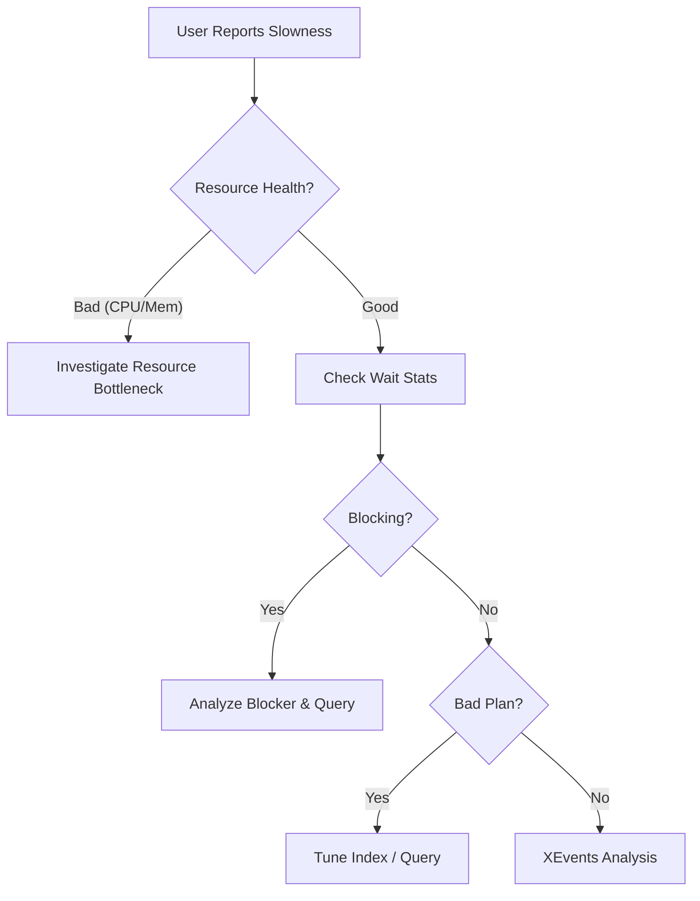

# Module 11: Troubleshooting Common Performance Issues

## 1. บทนำ (Introduction)
การแก้ไขปัญหาประสิทธิภาพ (Performance Troubleshooting) จำเป็นต้องมีกระบวนการที่เป็นระบบ (Systematic Approach) เพื่อระบุสาเหตุที่แท้จริง (Root Cause) ได้อย่างแม่นยำและรวดเร็ว การ "คาดเดา" โดยปราศจากหลักฐานข้อมูล (Data-driven evidence) อาจนำไปสู่การแก้ไขปัญหาที่ผิดจุด

บทเรียนนี้จะสรุปขั้นตอนการวิเคราะห์ปัญหามาตรฐาน (Standard Troubleshooting Workflow)

### 1.1 Skill Progression (ทักษะที่ควรได้จาก Module นี้)
- **ระดับ 1 – คิดแบบ Systematic Troubleshooting**
  - ตั้งคำถาม/นิยามปัญหา, แยก Scope/Timeline/Impact ได้ก่อนลงมือแก้ (ไม่เดาสุ่ม)
- **ระดับ 2 – ใช้ข้อมูลจาก Monitoring/DMVs/Waits มาประกอบการตัดสินใจ**
  - อ่านผลจาก Module 1–10 (CPU/Memory/I/O/Waits/Query/Index/Plan Cache/Monitoring) แล้วผูกเป็นภาพเดียวกันได้
- **ระดับ 3 – เดินตาม Workflow แก้ปัญหาจริง**
  - ใช้ Flow/Script ใน Module นี้เพื่อหาคอขวด (Resource vs Concurrency vs Query Design) อย่างเป็นขั้นตอน และเสนอแนวทางแก้ได้มากกว่าหนึ่งวิธี
- **ระดับ 4 – วางกระบวนการ Troubleshooting สำหรับทีม**
  - นำแนวคิดจาก Performance Center ของ Microsoft และบทเรียนทั้งคอร์ส มาจัดทำ Runbook/Checklist สำหรับทีม DBA/DevOps ขององค์กร เพื่อให้ทุกคนแก้ปัญหาได้เป็นระบบและสอดคล้องกัน

---

## 2. The Troubleshooting Workflow

**Performance Troubleshooting** คือกระบวนการหาสาเหตุที่ SQL Server ทำงานช้า โดยใช้ข้อมูลจาก DMOs, Wait Stats และ Execution Plans มาวิเคราะห์

> **หลักการสำคัญ:** ปัญหา Performance มักเกิดจากหนึ่งใน 3 สาเหตุหลัก: **Resource Bottleneck** (CPU/Memory/Disk), **Concurrency** (Blocking/Locking), หรือ **Query Design** (Missing Index/Bad Plan)

### Step 1: Define the Problem (Problem Definition)
ระบุขอบเขตและลักษณะของปัญหาให้ชัดเจน:
*   **Scope**: ปัญหาเกิดขึ้นกับผู้ใช้งานทั้งหมด หรือเฉพาะกลุ่ม?
*   **Timeline**: ปัญหาเกิดขึ้นตลอดเวลา (Consistent) หรือเป็นช่วงเวลา (Intermittent)?
*   **Locality**: ปัญหาเกิดขึ้นที่ Module ใด หรือ Report ตัวใด?

### Step 2: Validate the Server Health (Resource Health Check)
ตรวจสอบสถานะทรัพยากรพื้นฐานของระบบ:
*   **CPU**: มีการใช้งานสูงผิดปกติ (High Utilization) หรือไม่?
*   **Memory**: มีสัญญาณของ Memory Pressure หรือ OS Paging หรือไม่?
*   **Disk**: I/O Latency อยู่ในเกณฑ์ยอมรับได้หรือไม่?

### Step 3: Check SQL Server Internals (Wait Statistics Analysis)
หาก Server Resource ปกติ แต่ SQL Server ตอบสนองช้า จำเป็นต้องวิเคราะห์ **Wait Statistics**:
*   *Overview*: ใช้ Script วิเคราะห์ Wait Stats สะสมเพื่อดูภาพรวม (`02_Wait_Stats_Analysis.sql`)
*   *Real-time*: ตรวจสอบ Request ที่กำลังทำงานและการ Blocking ปัจจุบัน (`03_Current_Executing_Requests.sql`)

### Step 4: Identify the Root Cause
จำแนกประเภทของปัญหา:
1.  **Index/Query Design**: การขาด Index ที่เหมาะสม, Query ที่เขียนไม่ดี (Poorly Written Code), หรือ Parameter Sniffing
2.  **Concurrency**: ปัญหา Blocking Chains หรือ Deadlocks
3.  **Resource Bottleneck**: ข้อจำกัดด้าน Hardware (CPU/Memory/Disk Saturation)

### 2.5 Deep Dive: The Hierarchy of Bottlenecks (Chain of Pain)

ปัญหาประสิทธิภาพมักมีการส่งต่อผลกระทบเป็นลูกโซ่ (Domino Effect) การเข้าใจลำดับชั้นช่วยให้แก้ที่ **ต้นเหตุ** ไม่ใช่ปลายเหตุ:

1.  **Hardware Level (Root)**:
    *   Disk ช้า -> IOPS เต็ม -> Response Time สูง
2.  **Memory Level (Propagation)**:
    *   Disk ช้า -> Page อ่านเข้า Memory ช้า -> Thread ต้องรอ (PAGEIOLATCH) -> ถือ Latch นานขึ้น
3.  **Concurrency Level (Symptom)**:
    *   Latch นาน -> ขวาง Thread อื่นที่ต้องการ Page เดียวกัน -> Blocking Chain ยาว -> User รอนาน (Time out)

> [!TIP]
> **Don't shoot the messenger**: เจอ Blocking อย่าเพิ่งโทษ Locking เสมอไป ให้เช็คว่าเป็นผลพวงจาก Disk/CPU หรือไม่

### 2.6 Troubleshooting Flowchart (Visualized)

---

## 3. Common Scenarios & Resolution Strategies

### Scenario A: High CPU Utilization
*   *Potential Cause*: มักเกิดจาก Table Scan, Index Scan ขนาดใหญ่, Compilation ภาระสูง (Plan Bloat), หรือ Spinlock Contention
*   *Investigation*: ใช้ `01_Top_CPU_Queries.sql` เพื่อหา Query ที่ใช้ CPU สูงสุด
*   *Resolution*: ปรับปรุง Query (Tuning), สร้าง Index เพื่อเปลี่ยน Scan เป็น Seek, หรือปรับ Plan Cache Configuration

### Scenario B: High Blocking/Deadlocks
*   *Potential Cause*: Long-running Transactions, Poor Index Design, หรือ Application ที่ไม่ปล่อย Lock
*   *Investigation*: ตรวจสอบ Blocking Chain ด้วย `sys.dm_exec_requests` และ `sys.dm_tran_locks`
*   *Resolution*: ปรับปรุง Index, พิจารณา RCSI, หรือแก้ไข Application Code

### Scenario C: High I/O Latency
*   *Potential Cause*: ปริมาณข้อมูล (Working Set) มากกว่า Memory ที่มี (Buffer Pool Trashing) หรือ Storage Subsystem มีประสิทธิภาพไม่เพียงพอ
*   *Investigation*: ตรวจสอบ PerfMon (Avg Disk sec/Read), ค่า Page Life Expectancy (PLE) ต่ำ
*   *Resolution*: เพิ่ม Memory (Hardware Scale-up), ปรับปรุง Indexing เพื่อลด Physical Reads, หรือ Optimize Storage IOPS

---

## 4. Lab: The "Broken Server" Simulation

**[ไปยังคำแนะนำแล็บ](LABS/Lab_Instructions.md)**

ในแล็บสุดท้ายนี้ คุณจะได้ฝึกแก้ไขปัญหาเซิร์ฟเวอร์ที่มีปัญหาประสิทธิภาพหลายอย่างพร้อมกัน

---

## 5. Final Words
> **"Performance Tuning is a journey, not a destination."**

ระบบมีการเปลี่ยนแปลงข้อมูลตลอดเวลา Plan ที่เคยดีวันนี้ พรุ่งนี้อาจจะแย่
สิ่งสำคัญคือการ **Monitor (เฝ้าระวัง)** และ **Adapt (ปรับตัว)** ให้ทันกับการเปลี่ยนแปลงนั้น

ขอให้สนุกกับการ Tuning ครับ! :)

---

## 6. Review Quiz (Knowledge Check)

<b>1. ขั้นตอนแรกของการ Troubleshooting คืออะไร?</b>

Define the Problem: ต้องรู้ขอบเขตก่อนว่าช้าที่ใคร ใครเป็นคนบ่น และช้าช่วงเวลาไหน (ไม่ใช่เดาสุ่ม)

<b>2. ถ้า Server Resources (CPU/RAM) ปกติ แต่ User ยังบ่นว่าช้า เราควรดูอะไรต่อ?</b>

Wait Statistics: เพื่อดูว่า SQL Server กำลังรออะไรอยู่ (เช่นรอ Lock หรือรอ Network)

<b>3. ประโยค "Performance Tuning is a journey" หมายความว่าอย่างไร?</b>

การ Tuning ไม่ใช่งานที่ทำครั้งเดียวจบ เพราะข้อมูลเปลี่ยนตลอดเวลา Plan ที่เคยดีอาจจะแย่ลงได้ ต้องคอย Monitor เสมอ

